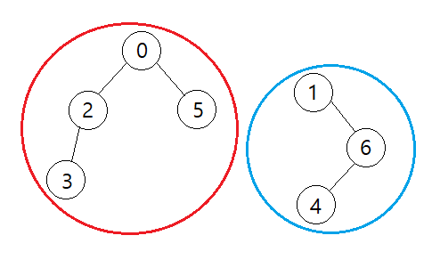
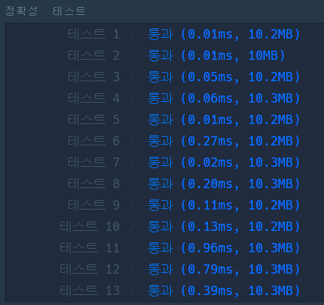
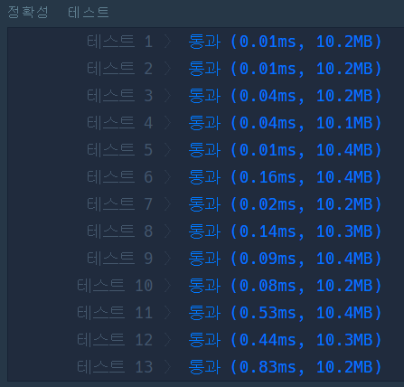
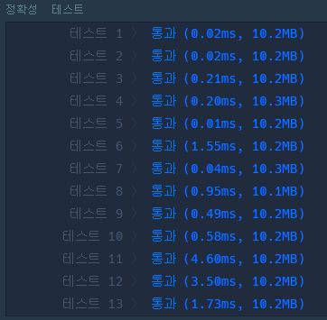
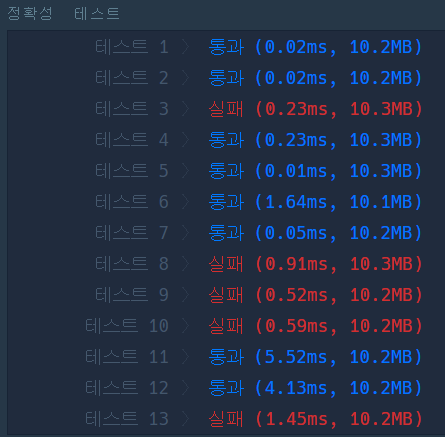
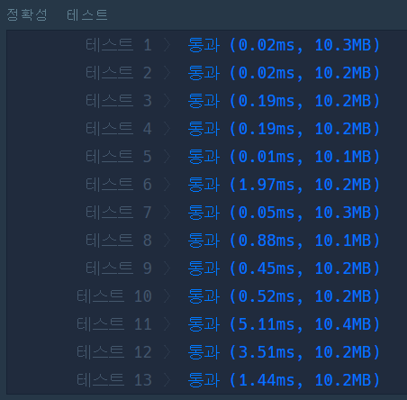

# 🌏 네트워크

## 🔸 My 풀이 과정

- ### 풀이 아이디어

  한 컴퓨터씩 확인하며 연결된 컴퓨터가 있을 때마다 해당 컴퓨터가 다른 컴퓨터들과 연결되어 있는지 확인하는 과정을 반복하여 네트워크 연결 정보를 기록한다. 연결 정보에 기록되지 않은 컴퓨터를 발견하면 네트워크 개수를 추가하고 전체 컴퓨터를 확인할 때까지 동일한 과정을 반복하면 된다. 

  예를 들어 다음과 같은 컴퓨터 연결 정보가 주어졌을 때 아래 우측 그림과 같은 2개의 네트워크가 형성된다.

    

  |     |  0  |  1  |  2  |  3  |  4  |  5  |  6  |
  | :-: | :-: | :-: | :-: | :-: | :-: | :-: | :-: |
  |  0  |  1  |  0  |  1  |  0  |  0  |  1  |  0  |
  |  1  |  0  |  1  |  0  |  0  |  0  |  0  |  1  |
  |  2  |  1  |  0  |  1  |  1  |  0  |  0  |  0  |
  |  3  |  0  |  0  |  1  |  1  |  0  |  0  |  0  |
  |  4  |  0  |  0  |  0  |  0  |  1  |  0  |  1  |
  |  5  |  1  |  0  |  0  |  0  |  0  |  1  |  0  |
  |  6  |  0  |  1  |  0  |  0  |  1  |  0  |  1  |

  초기에는 네트워크 연결 정보가 비어있으므로 네트워크 개수를 1개 추가하고, 0번 컴퓨터부터 시작하여 2번, 3번, 5번 컴퓨터에 연결된 컴퓨터들을 확인하는 과정을 거치면 빨간 네트워크 연결 정보가 기록된다. 이후 1번 컴퓨터는 빨간 네트워크에 포함되지 않으므로 네트워크 개수를 1개 추가하고 1번 컴퓨터부터 시작하여 6번, 4번 컴퓨터에 연결된 컴퓨터들을 확인하는 과정을 거치면 파란 네트워크 연결 정보가 기록된다.

- ### 소스 코드

  1. 해당 과정을 [DFS 알고리즘으로 구현한 코드](network_dfs.py)이다.
  2. 해당 과정을 [BFS 알고리즘으로 구현한 코드](network_bfs.py)이다.

- ### 실행 결과 (DFS/BFS)

  
  

 

## 🔹 Other 풀이 분석

- 해당 문제를 플로이드 워셜 알고리즘 방식으로 간결하게 풀어낸 풀이가 있어서 이를 분석해보았다. 처음에 소스 코드만 보면서 풀이 아이디어를 분석하려고 했는데 놓친 부분이 있어서인지 잘 이해가 되지 않았다. 그래서 이해가 매끄럽지 않은 부분에 대해 포인트를 잡고 직접 실행해보니 어떤 생각으로 접근을 했는지 알 수 있었다.

- ### 풀이 아이디어

  위에서 DFS나 BFS로 접근했던 방식처럼 주어진 컴퓨터들의 연결 정보를 통해 네트워크 연결 정보를 기록하여 네트워크의 개수를 알아내는 방식이다. 차이점이 있다면 이 방식은 플로이드 워셜 알고리즘에서 각 거점을 거치는 경로를 계산하고 최단 경로를 발견할 시 경로 테이블의 값을 치환하여 모든 루트에 대한 최단 경로 테이블을 구성하는 방식과 비슷하다. 현재 컴퓨터와 연결된 컴퓨터가 있으면 네트워크 연결 정보를 기록하는 테이블에서 현재 컴퓨터에 해당하는 값을 연결된 컴퓨터의 값으로 치환하며 네트워크 연결 정보 테이블을 구성해나간다.

  - 예를 들어 주어진 컴퓨터들의 연결 정보가 다음과 같을 때

    |     |  0  |  1  |  2  |
    | :-: | :-: | :-: | :-: |
    |  0  |  1  |     |  1  |
    |  1  |     |  1  |     |
    |  2  |  1  |     |  1  |

  - 초기 네트워크 연결 정보 테이블

    |  0  |  1  |  2  |
    | :-: | :-: | :-: |
    |  0  |  1  |  2  |

  - 테이블 치환 과정 (computers[현재][연결 대상] : [네트워크 연결 정보 테이블])

    1. computers[0][0] : [0, 1, 2]
    2. computers[0][2] : [2, 1, 2]
    3. computers[0][1] : [2, 1, 2]
    4. computers[2][0] : [2, 1, 2]
    5. computers[2][2] : [2, 1, 2]

- ### 소스 코드

  - [플로이드 워셜 알고리즘으로 접근한 풀이](network_floyd.py)

- ### 실행 결과

  

 

- ### 수정한 소스 코드

  단순히, 분석만 하면 재미가 없기 때문에...?? 약간의 수정을 해보았다. 위 코드와 반대로 연결 컴퓨터의 값을 현재 컴퓨터의 값으로 변경하며 네트워크 연결 정보 테이블을 구성하는 것이다.

  - [수정 코드 버전1](network_fixed_floyd_v1.py)

  예상한 것과 달리 수정한 코드는 일부 테스트에서 실패 판정을 받았다.
  

  그래서, 해당 코드의 테스트 예시들을 생각해보며 그 과정을 머릿 속으로 추적해보았지만 미처 간과한 부분을 깨닫지 못해 원인을 찾을 수 없었다.

  결국, 다음과 같이 수정 전후 코드를 비교하는 테스트 코드를 작성하여 실패 케이스가 나왔을 때 왜 실패했는지에 대해 분석하기로 하였다.

  - [분석 테스트 코드](network_test.py)

  - 분석 결과

            생성된 랜덤 리스트 / 각 행에서 네트워크 테이블(network_map) 갱신 결과
                computers    /  초기값 : 0 1 2 3 4
                1 0 1 0 1    /  0 1 0 3 0
                0 1 1 1 0    /  1 1 1 3 '0' -> ❗❓ 실수 발견!!!
                1 1 1 1 0    /  1 1 1 1 0
                0 1 1 1 0    /  1 1 1 1 0
                1 0 0 0 1    /  0 1 1 1 0

    computers[1][2]를 수행할 때 1 1 1 3 <strong>_1_</strong>과 같은 결과를 예상했지만, 마지막 값이 변경되지 않는 결과가 나왔다. 그 이유는 network_map[2]와 값을 비교하면서 중간에 network_map[2]의 값을 변경해버렸기 때문이다...😅 그래서 해당 index 이후의 값에 대해서는 제대로 변경이 이루어지지 않은 것이다. 이를 좀 더 일반화하면 비교 대상인 값과 동일한 index에서의 값을 변경해서 중간에 비교 값이 바뀌어 문제가 되는 것이다.

    그럼 어떻게 해결하면 될까? 답은 간단하다. 비교 대상의 값을 미리 변수에 저장해놓고 이용하면 된다.

    - [수정이 완료된 코드](network_fixed_floyd.py)

    - 실행 결과

      

 

## 🔎 두 알고리즘의 성능 비교 : DFS/BFS vs 플로이드 워셜

- 플로이드 워셜 방식으로 구현한 알고리즘이 DFS/BFS 방식으로 구현한 알고리즘보다 코드는 간결해 보이지만 실행 결과를 보면 알 수 있듯이 성능은 그렇게 좋지 못하다. 그 이유는 DFS/BFS 방식의 알고리즘은 2중 for문을 사용하므로 시간 복잡도가 약 O(N²)인 것에 비해 플로이드 워셜 방식의 알고리즘은 3중 for문을 사용하기 때문에 약 O(N³)의 시간 복잡도를 갖기 때문이라고 할 수 있다.
