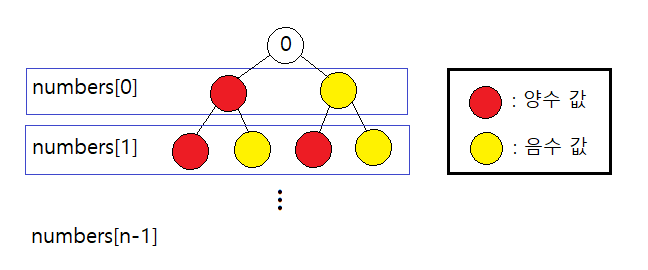
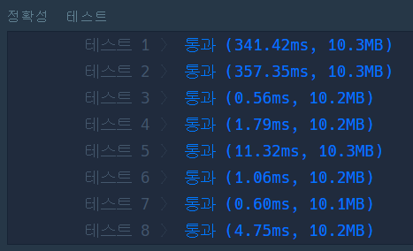
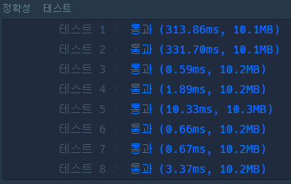
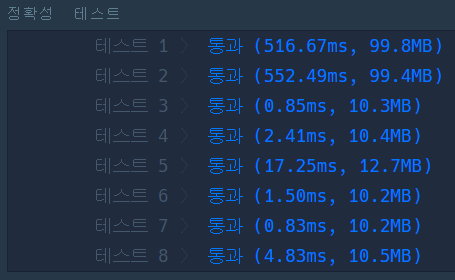

# 🎯 타겟 넘버

문제를 풀기 위해 아래 그림과 같은 포화 이진 트리 모델로 생각해봤지만, 이를 코드로 풀어내지 못했다.(아직 갈 길이 멀구나...😅)

 

도통 감이 잡히지 않아 결국 인터넷 상의 풀이를 참고하게 되었고 내가 생각했던 트리 모델의 개선점을 파악할 수 있었다.

 

위 그림과 같이 각 노드의 값을 현재까지의 합으로 변경함으로써 DFS나 BFS 알고리즘을 이용한 코드로 풀어내는 것이 좀 더 수월해졌다.

 

## 🔸 DFS로 접근한 풀이

- 알고리즘 동작 과정

  1. 시작 노드(0)를 스택에 넣고 스택의 최상단 노드가 트리의 최하단 단말 노드가 될 때까지 각 노드에서 다음 2가지 노드를 스택에 넣는 과정을 반복한다.

     - 노드1 = 현재 노드 값 + 현재 레벨(=index)의 numbers 값
     - 노드2 = 현재 노드 값 - 현재 레벨(=index)의 numbers 값

  2. 스택의 최상단 노드가 트리의 최하단 단말 노드이면 스택에서 노드를 꺼내고 노드 값이 target과 동일한 경우 1, 아닌 경우 0을 반환하여 가능한 방법의 수를 카운트한다.

- 소스 코드

  | [일반적인 DFS 코드](target_number_dfs.py) | [더 간단한 DFS 코드](target_number_sp_dfs.py) |
  | :---------------------------------------: | :-------------------------------------------: |

   

- 각각의 실행 결과

  
  

 

## 🔸 BFS로 접근하는 풀이

- 알고리즘 동작 과정

  1. 시작 노드(0)를 큐에 넣는다.
  2. 큐에서 노드를 꺼내 다음 2가지 노드를 큐에 넣는다.

     - 노드1 = 현재 노드 값 + 현재 레벨(=index)의 numbers 값
     - 노드2 = 현재 노드 값 - 현재 레벨(=index)의 numbers 값

  3. 큐가 빌 때까지 2번 과정을 반복하다가 큐에서 꺼낸 노드가 트리의 최하단 단말 노드이면 노드 값이 target과 동일한 경우에만 가능한 방법의 수를 1씩 추가한다.

- [BFS 코드](target_number_bfs.py)

- 실행 결과

  

 

## 🔸 완전 탐색으로 접근한 풀이

- 알고리즘 동작 과정

  1. 주어진 numbers의 모든 원소에 대해 (음수, 양수) 쌍을 구한다.
  2. 데카르트 곱(Cartesian Product)을 이용해 1번에서 구한 쌍들의 모든 순서쌍을 구한다. 3. 2번에서 구한 각 순서쌍의 합을 계산하여 가능한 방법의 수를 계산한다.

- [Cartesian Product 코드](target_number_cartesian.py)

- 실행 결과

  
