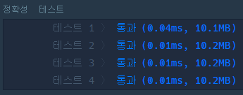
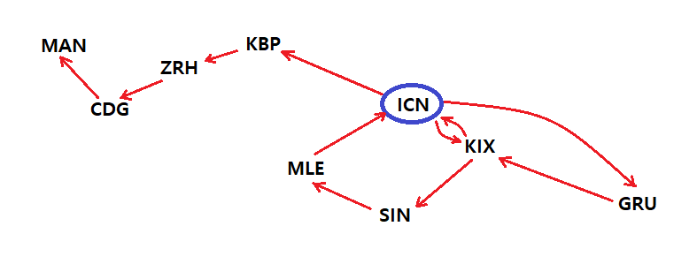

# 🗺 여행경로

## 🔸 My 풀이 과정

- ### 풀이 아이디어

  현재 출발하는 공항에서 도착 가능한 공항 중 알파벳 순서가 앞서는 경로를 우선적으로 탐색해나가며 모든 티켓을 사용하였는지 확인하면 된다.

- ### 소스 코드

  [DFS 알고리즘으로 풀이한 코드](my_travel_route.py)

- ### 알고리즘 동작 과정

  1. 먼저, 각 출발 공항별로 도착 가능한 공항들을 알파벳 순으로 정렬한다.
  2. 주어진 티켓들 중 출발 공항이 현재 공항과 일치하는 가장 먼저 나오는 티켓을 사용하여 해당 도착 공항으로 이동한다.
  3. 2번 과정을 반복해나가며 더 이상 도착 가능한 공항이 없거나 티켓을 모두 사용했으면 현재 공항부터 경유한 모든 경로들을 반환한다.
  4. 3번에서 반환한 경로들의 수가 이전 남아있던 티켓의 수와 동일하면 모든 티켓을 사용한 것이므로 해당 공항에서의 경로 탐색을 종료하고 해당 공항부터 경유한 모든 경로들을 반환한다.

- ### 실행 결과

  

 

## 🔹 Other 풀이 분석

- ### 풀이 아이디어

  다른 풀이 방법들 중 좀 더 간단하고 명확한 그림이 그려지는 알고리즘이 있어서 분석해 보았다. 기본적인 풀이 아이디어는 위와 비슷하지만 차이점은 티켓을 사용하여 공항을 이동하다가 더 이상 이동할 공항이 없으면 현재 공항을 이동 경로에 기록한다는 점이다. 이것이 의미하는 것은 해당 공항에서는 더 이상 이동할 방법이 없기 때문에 다른 공항들보다 나중에 방문해야 한다는 것을 의미한다.

  예를들어 다음 그림과 같은 경로가 주어졌다고 가정하고 위 아이디어를 이해해보자.

  

  | 출발 |    도착     |
  | :--: | :---------: |
  | ICN  | GRU KBP KIX |
  | GRU  |     KIX     |
  | KBP  |     ZRH     |
  | KIX  |   ICN SIN   |
  | SIN  |     MLE     |
  | MLE  |     ICN     |
  | ZRH  |     CDG     |
  | CDG  |     MAN     |

  위 표는 주어진 tickets의 출발 공항별로 도착 공항들을 정렬한 것이다.(출발 공항의 순서는 고려하지 않았다.)

  "ICN" 공항부터 출발하여 티켓을 사용하며 도착 공항들을 순서대로 따라가보면 다음과 같은 결과가 나온다. (사용한 티켓은 소모되어 없어진다고 가정하자.)

  - ICN -> GRU -> KIX -> ICN -> KBP -> ZRH -> CDG -> MAN

  MAN 공항에서는 더 이상 이동 가능한 공항이 없으므로 MAN 공항을 이동 경로(route)에 기록하자.

  - route = MAN

  MAN 공항부터 이전 공항으로 거슬러 올라가며 다른 공항으로 가는 티켓이 있는지 확인한다. 없는 경우 현재 공항을 이동 경로에 기록하고 있는 경우 해당 공항으로 이동한다. 다음은 이를 모두 수행한 결과이다.

  - CDG : route = MAN, CDG
  - ZRH : route = MAN, CDG, ZRH
  - KBP : route = MAN, CDG, ZRH, KBP
  - ICN : KIX -> SIN -> MLE -> ICN
    - ICN : route = MAN, CDG, ZRH, KBP, ICN
    - MLE : route = MAN, CDG, ZRH, KBP, ICN, MLE
    - SIN : route = MAN, CDG, ZRH, KBP, ICN, MLE, SIN
    - KIX : route = MAN, CDG, ZRH, KBP, ICN, MLE, SIN, KIX
    - ICN : route = MAN, CDG, ZRH, KBP, ICN, MLE, SIN, KIX, ICN
  - KIX : route = MAN, CDG, ZRH, KBP, ICN, MLE, SIN, KIX, ICN, KIX
  - GRU : route = MAN, CDG, ZRH, KBP, ICN, MLE, SIN, KIX, ICN, KIX, GRU
  - ICN : route = MAN, CDG, ZRH, KBP, ICN, MLE, SIN, KIX, ICN, KIX, GRU, ICN

  위 과정에서 얻은 이동 경로를 역순으로 하면 모든 티켓을 사용한 이동 경로가 나오게 된다.

  - 결과 : ICN, GRU, KIX, ICN, KIX, SIN, MLE, ICN, KBP, ZRH, CDG, MAN

  이때, 도착 공항들을 먼저 알파벳 사전순으로 정렬해놓고 시작했기 때문에 "이동 경로가 다수일 경우 알파벳이 앞서는 순서로"라는 조건을 보장할 수 있다.

- ### 소스 코드

  [위 알고리즘을 구현한 코드](other_travel_route.py)

  🔅 위 코드는 다른 분의 코드에서 약간의 개선을 더했다. 도착 공항들을 정렬할 때 역순으로 정렬함으로써 티켓을 사용하고 pop(0)으로 리스트의 맨 앞에서 꺼내는 부분을 pop()으로 변경하였다. (리스트의 원소의 개수가 N이라면 pop(0)의 시간 복잡도는 O(N)이고 pop()은 O(1)이다.)

- ### 실행 결과

  
