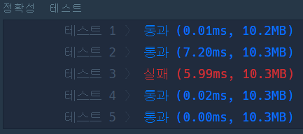
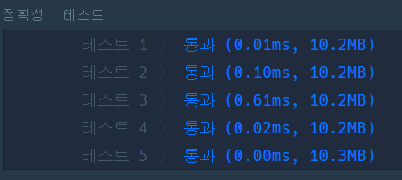

# 🔠🔄 단어 변환

## 🔸 My 풀이 과정

- ### 풀이 아이디어

  한번에 하나의 문자만 변환이 가능하므로 begin과 words의 단어들을 비교하며 다른 문자의 수가 1개인 원소가 있으면 begin을 해당 단어로 변환하고 그 단어를 제외한 words에서 동일한 과정을 반복한다. 이후 begin과 target이 동일해지면 words에 남아있는 단어의 개수를 반환하고 반환된 개수 중 가장 큰 값을 처음 words의 단어 개수에서 빼주면 변환에 필요한 최소 단계를 계산할 수 있다.

- ### 소스 코드

  1.  다음은 위 알고리즘을 바탕으로 구현했던 [초기 버전 코드](word_conversion_init.py)이다.
  2.  [개선된 코드](word_conversion.py)

- ### 실행 결과

  
  

- ### 실패 원인 분석

  초기 버전 코드의 경우 여러번 수정을 했었지만 계속해서 테스트 3번에서 실패를 했다. 테스트 과정에서 디버깅이 불가능하다는 점과 테스트 값이 어떤 것인지 알 수 없다는 점이 많은 시간을 고민하게 만들었다. 적어도 출력 값이라도 확인할 수 있었으면... 

  먼저 위 두 코드 중 바뀐 부분만 살펴보면 다음과 같다.

      # dfs function
      1. 초기 버전
      remain = 0 (2️⃣: ❌)
      for i in range(len(words)):
        if len(set(begin + words[i])) == len(begin) + 1: (1️⃣: ❌)

      2. 수정 버전
      remain = -1
      for i in range(len(words)):
        if [i != j for i, j in zip(begin, words[i])].count(True) == 1:

      # solution function
      1. 초기 버전
      answer = len(words) - dfs(begin, target, words) (❌)

      2. 수정 버전
      remain = dfs(begin, target, words)
        answer = len(words) - remain if remain > -1 else 0 (3️⃣)

  처음으로 발견한 잘못된 부분은 1번의 조건문이었다. 서로 다른 문자가 1개인 단어를 찾기 위해 집합의 특성을 이용했는데, 여기서 간과했던 점이 2가지 있었다. 

  - 첫 번째는 다른 문자가 1개이기 때문에 집합으로 변환했을 때의 길이를 원래 단어의 길이 + 1로 생각했지만 그보다 작은 경우가 존재했다. 예를 들어 "gog"와 "dog"는 1개의 문자만 서로 다르지만 집합으로 처리하게 되면 {d, g, o}가 되어 총 길이는 3개가 된다. 

  - 두 번째는 집합은 원소의 순서를 보장하지 않는다는 점이다. 이말은 즉, "odg" 와 "dog"는 순서상으로 보면 서로 다른 문자가 2개이지만, 집합 연산을 하게되면 원소의 길이가 3이 되어 해당 조건을 만족시키게 된다. 

  따라서, begin과 words의 해당 단어를 한 문자씩 비교하며 다른 문자가 1개인 경우에만 조건을 만족하도록 개선하였다. 

  두 번째로 발견한 잘못된 부분은 2번의 remain 초기값이었다. 초기값을 0으로 설정하면서 발생하는 문제는 변환이 불가능한 경우와 words의 모든 단어를 사용해 변환하는 경우를 구분할 수 없다는 점이다. 예를 들어 "mit"와 "dog"가 각각 begin, target으로 주어지고 words가 ["mut", "mug", "mog", "dog"]로 주어졌다면 변환을 하기 위해 모든 단어를 사용해야하므로 반환 후 남아있는 words의 단어 개수는 초기값과 동일한 0이 될 것이다. 

  따라서, 2번의 초기값을 -1로 수정하여 최종 반환되는 값이 -1인 경우에는 3번과 같이 변환이 불가능한 경우라는 것을 구별해주었다. 

  하지만, 여기서 또다른 문제를 발견할 수 있었다. 2번의 remain 초기값을 0으로 한 경우에도 모든 테스트를 통과한다는 점이다. 이 부분은 소스 코드의 문제보다는 변환 과정을 거치며 최종적으로 target이 될 수 없는 경우에 대한 테스트 케이스가 부족했기 때문이라고 생각한다.
