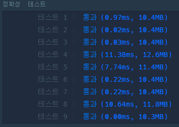

# 🔢👉🏼 N으로 표현

> 이번 문제는 오랜 시간동안 풀이 방법이 잘 떠오르지 않아서 결국 인터넷의 풀이 아이디어를 조금 참고하여 해결할 수 있었다. (동적 계획법은 너무 어려운 것 같다...😭)

## 🔸 풀이 과정

- ### 풀이 아이디어

  문제 조건에 의해 최솟값이 8보다 크면 -1을 반환하므로 주어진 수 **N의 사용 가능한 횟수는 1 ~ 8까지**이다. 따라서, 1부터 8까지 N의 사용 횟수별로 만들 수 있는 숫자들을 차례대로 구하고 number와 비교하여 일치하는 수가 있는지 확인하면 된다. 

  예를 들어 N=3이라고 가정하면

  - 1번 사용으로 가능한 수의 집합 set(1) : 3
  - 2번 사용으로 가능한 수의 집합 set(2)

    - 33
    - 3 + 3
    - 3 - 3
    - 3 \* 3
    - 3 / 3

    여기서, set(2)의 원소에는 3을 2번 이어붙인 값과 2개의 set(1)간의 사칙연산한 결과 값들이 포함된다는 것을 알 수 있다. 즉, 2가 1 + 1로 표현되는 것처럼 set(2)를 다시 아래와 같이 표현할 수 있다.

    - 33
    - set(1) # set(1) (#은 사칙연산을 의미한다.)

  - 마찬가지로, 3번 사용으로 가능한 수의 집합 set(3)는 다음과 같이 표현된다.

    - 333
    - set(1) # set(2)
    - set(2) # set(1)

  - 이를 좀 더 일반화하여 표현하면 set(N)의 원소들은 다음과 같다.

    - NN ... N (N개)
    - set(1) # set(N - 1)
    - set(2) # set(N - 2)  
       ...
    - set(N - 1) # set(1)

  따라서, 위 점화식을 통해 set(1)부터 set(8)까지 차례대로 원소들을 구하고 number와 동일한 값이 존재하는지 확인하면 된다.

- ### 소스 코드

  위 알고리즘을 바탕으로 구현한 [소스 코드](express_n.py)이다.

- ### 실행 결과

  
