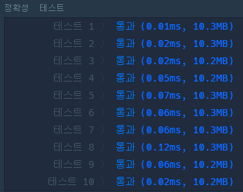
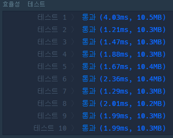

# 🏫 등굣길

## 🔸 풀이 과정

> 해당 문제는 어렵지 않게 풀 수 있는 문제였다. 하지만, 물 웅덩이를 지나는 경우를 좀 더 간단하게 제외하기 위해 초기 dp 테이블 값 설정을 어떻게 할지 고민하다보니 시간을 많이 소모해버렸다...😅

- ### 풀이 아이디어

  집 위치(1, 1)에서부터 학교 위치(m, n)에 최단 거리로 도착하기 위해서는 총 이동 횟수가 m + n(집 위치 포함)인 경우만 고려해주면 된다. 즉, 각 지점에서 우측하단 방향으로만 이동해야 해당 조건을 만족시키며, 이는 어떤 지점에 도달하는 경우가 "좌측 방향에서 오는 경우 + 윗 방향에서 오는 경우"라는 것을 의미한다. 따라서, 각 지점에 도착하는 경우를 차례로 구해나가면 학교가 위치한 지점에 최단 거리로 도착하는 경우의 수를 알 수 있다. 하지만 여기서, 중요한 점은 물 웅덩이가 있는 곳은 지나갈 수 없으므로 해당 지점을 지나가는 경우는 모두 제외해줘야 한다.

- ### 소스 코드

  해당 알고리즘을 바탕으로 구현한 [소스 코드](way_to_school.py)이다.

- ### 실행 결과

  
  
