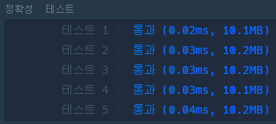
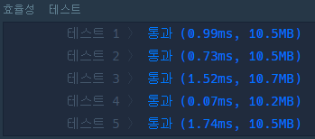
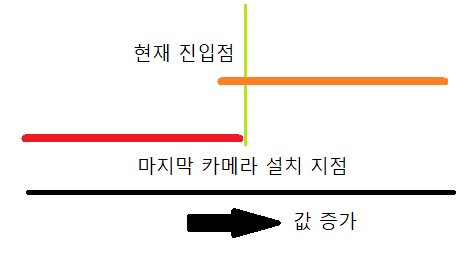
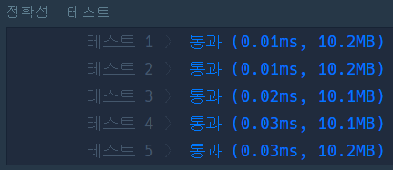
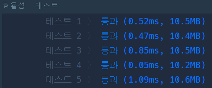
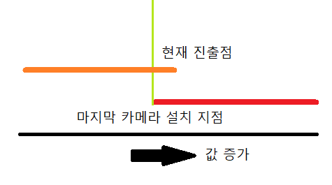
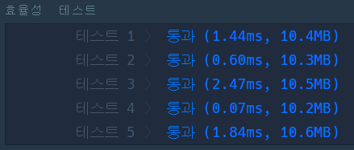

# 📸 단속카메라

## 🔸 My 풀이 과정

- 풀이 아이디어 : 단속용 카메라를 고속도로의 모든 차량이 한 번은 만나게 하면서 그 설치 개수를 최소로 하려면 <strong>_차량들의 이동 경로 중 최대한 중복되는 구간에 카메라를 설치_</strong>해야 한다. 따라서, 주어진 차량들의 이동 경로를 오름차순으로 정렬하고 순차적으로 확인하며 이전까지의 중복 구간을 벗어날 때마다 카메라를 한대씩 추가하면 된다.

- 위와 같은 아이디어로 [구현한 알고리즘](my_enforcement_camera.py)의 동작은 다음과 같다.

  1. 차량들의 이동 경로를 진입점 기준으로 오름차 정렬하고 순차적으로 순회하며 다음 과정을 수행한다.

     1-1. 현재 차량의 진입점 값 <= 중복 구간의 진출점 값인 경우  
     해당 차량은 중복 구간에 포함되므로 중복 구간의 진출점 값을 현재 차량의 진출점 값과 비교해 더 작은 값으로 변경한다.

     1-2. 현재 차량의 진입점 값이 중복 구간의 진출점 값을 초과하면  
     해당 차량은 중복 구간에 포함되지 않으므로 카메라 설치 수를 추가하고 현재 차량의 진출점 값을 새로운 중복 구간의 진출점 값으로 설정한다.

 

- 실행 결과 : 
  
   

 

## 🔹 Other 풀이 분석

- 다른 사람들의 풀이 중 이동 경로의 중복 구간을 더욱 간결하고 효율적으로 판별한 2가지 알고리즘을 분석해보았다.

  1. 주어진 이동 경로들을 <strong>_진출점을 기준으로 오름차순_</strong>으로 정렬하여 판단하는 방법 (발상의 전환...?!)
  2. 주어진 이동 경로들을 <strong>_진입점을 기준으로 내림차순_</strong>으로 정렬하여 판단하는 방법

* 먼저, [1번 방법의 알고리즘](other1_enforcement_camera.py)을 그림으로 나타내보았다.

  

  진출점을 기준으로 오름차 정렬하였으므로 다음 이동 경로의 진출점은 항상 이전 경로의 진출점보다 크기 때문에 현재 이동 경로의 진입점과 마지막 카메라 설치 지점(이전까지 최소 진출점)을 비교하면 된다

  1. 현재 진입점 <= 마지막 카메라 설치 지점 : 카메라를 추가로 설치할 필요가 없다.
  2. 현재 진입점 > 마지막 카메라 설치 지점 : 새로운 카메라를 설치하고 마지막 카메라 설치 지점을 현재 진출점으로 변경한다.

 

- 실행 결과 :  
  
  

 

- 다음으로, [2번 방법의 알고리즘](other2_enforcement_camera.py)을 그림으로 나타내보았다.

  

  진입점을 기준으로 내림차 정렬하였으므로 다음 이동 경로의 진입점은 항상 이전 경로의 진입점보다 작기 때문에 현재 이동 경로의 진출점과 마지막 카메라 설치 지점(이전까지 최대 진입점)을 비교하면 된다

  1. 현재 진출점 >= 마지막 카메라 설치 지점 : 카메라를 추가로 설치할 필요가 없다.
  2. 현재 진출점 < 마지막 카메라 설치 지점 : 새로운 카메라를 설치하고 마지막 카메라 설치 지점을 현재 진입점으로 변경한다.

 

- 실행 결과 :  
  
  
