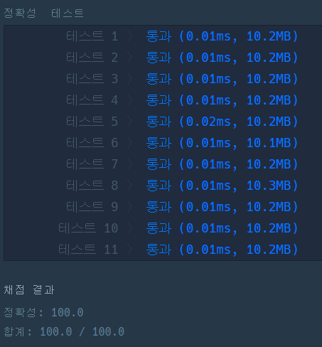

# 🎮 [조이스틱](joystick.py)

- 풀이 과정 :

  - 주어진 문자열을 순차적으로 순회하며 'A'가 아닌 알파벳에 대해 다음을 수행한다.

    1. **커서가 가리키는 이전 'A'가 아닌 위치부터 끝지점까지 정방향(우측) 이동 거리 > 현재 위치까지 역방향(좌측) 이동 거리**인 경우 이동 방향을 역방향으로 전환하고 현재 위치까지의 역방향 이동 거리를 조작 횟수에 추가한다.(**현재 위치에서 정방향 총 이동량보다 역방향 총 이동량이 더 적으므로**)

    2. 이동 방향이 정방향인 경우 매회 커서 위치로부터 현재 위치까지 이동 거리를 조작 횟수에 추가하고, **역방향인 경우 1번에서 이동할 모든 거리를 추가했으므로** 더 이상 조작 횟수에 이동 거리를 추가하지 않는다.

    3. 현재 위치의 알파벳으로 변경하기 위한 사전순 이동과 역사전순 이동을 비교하여 둘 중 최소값을 조작 횟수에 추가하고, 커서를 현재 위치로 변경하여 'A'가 아닌 위치를 기록한다.

 

- 알고리즘 수행 결과 : 
  
