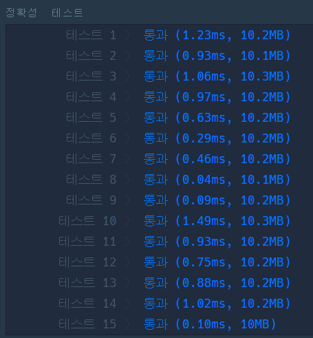
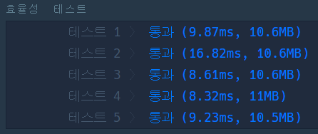

# 🚤 구명보트

## 🔸 My 풀이 과정

- 풀이 아이디어 : 구명보트의 개수를 최소로 사용하기 위해서는 최대한 많은 인원들이 2명씩 보트에 탑승해야 한다. 따라서, 체중이 많이 나가는 사람부터 순차적으로 체중이 적게 나가는 사람과 쌍을 만들고 보트의 무게 제한을 만족하는지 확인 후 보트에 탑승시키면 된다. 

 

- 이 문제를 해결하기 위해 [스택을 활용하여 구현한 알고리즘](my_lifeboat.py)의 동작은 다음과 같다.

  1. 주어진 사람들의 체중을 내림차순으로 정렬하고 체중이 높은 사람부터 순차적으로 순회하며 다음 과정을 수행한다. 
     1-1. 현재 지정된 체중 값과 스택의 Top값의 합이 제한 무게 이하이면 스택의 Top에서 값을 꺼내고 보트의 개수를 1 증가시킨다. 
     1-2. 제한 무게를 초과하면 스택에 현재 지정된 체중 값을 넣는다. 
  2. 스택에 사람들이 남아있는 경우 그 수를 현재 보트의 개수에 추가한다. 
     (남은 사람들은 보트에 함께 탑승할 수 없는 사람들이다.)

 

- 실행 결과 : 
  
   

 

## 🔹 Other 풀이 분석

- 다른 사람들의 풀이 중 [더 간결하고 깔끔한 코드](other_lifeboat.py)가 있어서 이를 분석해보았다. 풀이 아이디어 자체는 비슷했지만 전체 사용한 보트 수를 구하는 방식이 참신한 것 같았다. 총 인원에는 2명씩 탑승한 보트 수의 2배가 되는 인원이 포함되어 있으므로 2명씩 탑승한 보트 수를 구한 후 이 값을 총 인원에서 빼주면 전체 사용한 보트 수가 나온다는 것이다.

 

- 실행 결과 : 
  
  
