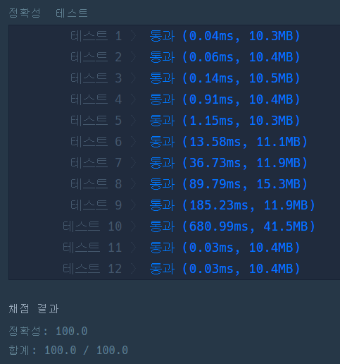
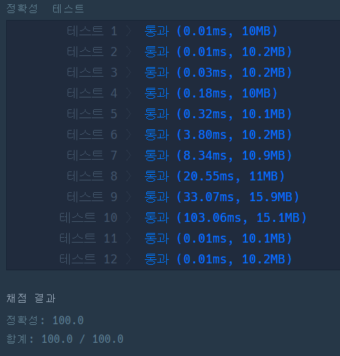

# 🔝 큰 수 만들기

## 🔸 My 풀이 과정

- 풀이 아이디어 :
  길이가 n인 숫자에서 k개의 숫자를 제거하여 최대값이 되게 하려면 n-k개의 숫자가 남을 때까지 <strong>앞에서부터 최대 숫자를 결정<strong>해나가야 한다. 즉, Greedy 알고리즘을 이용하는 문제이다.

  1. 남은 제거 횟수가 x인 경우 현재 시작 위치부터 x + 1개의 숫자 중 최대값을 결정한다.(초기 시작 위치=0)
  2. 1번에서 결정한 수 앞에 있는 모든 숫자를 제거하고 제거한 개수만큼 k값을 감소시킨다.
  3. 시작 위치를 1번의 최대값 위치 + 1로 변경하고 k=0이 될 때까지 1 ~ 2 과정을 반복한다.

> 위 과정을 O(n²)의 시간 복잡도를 지닌 이중 반복문(while + for)으로 구현한 결과 효율성 때문인지 1 ~ 2개의 테스트에서 실패 판정을 받았다. 주어지는 숫자의 범위가 최대 1,000,000였기 때문에...

그래서, 매회 최대값을 찾는 과정을 우선순위 큐로 구현하여 이를 개선하였고 이 구현에서의 예상 시간 복잡도는 다음과 같다. 
최악의 경우는 주어진 숫자가 내림차순이고 k = 1일 때, 큐에 삽입, 삭제 연산이 가장 많이 발생한다. N개의 원소에 대한 우선순위 큐의 삽입, 삭제 연산은 각각 O(logN)이므로

1. 우선순위 큐에 N개의 원소 삽입 연산 : NlogN
2. 우선순위 큐에서 N개의 원소 삭제 연산 : NlogN

따라서, NlogN + NlogN = 2NlogN이므로 약 O(NlogN)의 시간 복잡도가 소요된다고 할 수 있다.

> 결과적으로, [우선순위 큐를 이용한 구현](make_large_number_priority_q.py)의 경우 아래와 같이 모두 통과 판정을 받을 수 있었다.

 

 

## 🔹 Other 풀이 분석

여러 다른 풀이 방법들이 있었지만, 가장 인상 깊었던 [stack을 이용한 풀이](make_large_number_stack.py)를 나름대로 분석해 정리해보았다. 
기본적인 풀이 아이디어는 위와 비슷한 것 같지만, **각 자리의 최대값을 stack을 이용해 결정**한다는 점이 가장 핵심적인 차이라고 생각한다. 

알고리즘의 동작 과정은 다음과 같다.

- 먼저, 주어진 숫자를 하나씩 차례로 순회하며 아래 1, 2과정을 수행한다.

  1. 제거 횟수(k)가 남아있고 현재 위치의 값이 stack의 top값보다 큰 경우 stack에서 값을 하나씩 꺼내고 제거 횟수(k)를 1씩 감소시킨다.(이 과정을 통해 stack에는 각 자리의 최대값만 남게 된다.)

  2. 1번을 만족하지 않으면 현재 위치의 값을 stack에 추가한다.

* 다음으로, 결과 값으로 현재 stack에 남아있는 값들을 묶어주면 된다.(단, 주어진 숫자의 끝 부분이 내림차순인 경우 k != 0이 될 수 있으므로 stack에 마지막으로 추가된 k개의 숫자를 제외한다.)

> 그럼, 위 알고리즘은 효율성이 어떻게 될까??

예상한 시간 복잡도는 다음과 같다.

1. 스택에 총 N개의 원소 삽입 연산 : N
2. 스택에서 최대 K개의 원소 삭제 연산 : K

따라서, 약 O(N + K)의 시간 복잡도가 소요된다고 할 수 있고 그 결과를 측정해보았다.

테스트 10번을 보면 약 6배이상 속도 차이가 나는 것을 확인할 수 있다...

> 내가 풀었던 방식보다 상당히 높은 효율성을 지닌다는 것을 알 수 있었고 이런 방법을 생각해내다니 정말 대단하고 놀랍다... 더욱 더 분발해야겠다고 생각했다.
