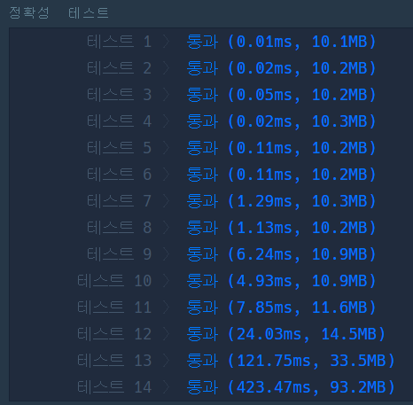
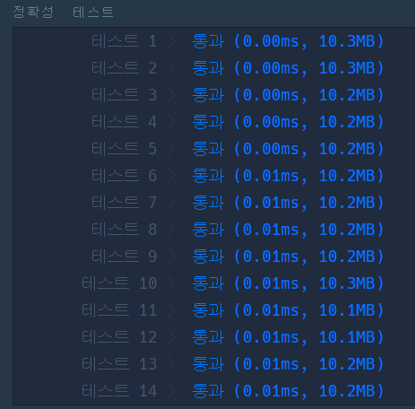
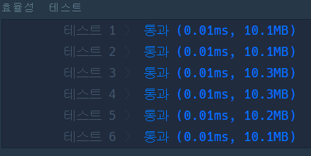

# 1️⃣2️⃣4️⃣ 124 나라의 숫자

## 🔸 My 풀이 과정

- 풀이 아이디어 : 124 나라의 모든 수는 각 자리의 값이 [1, 2, 4] 3개의 숫자 중 하나로 구성되어 있다. 연속된 3개의 숫자마다 자리올림이 발생하는 3진법과 유사한 특징을 지니므로 10진수를 3진수로 변환하는 방법을 활용하여 문제를 풀 수 있을 것이다.

> 하지만, 처음에는 변환 값을 구하기 위해 3으로 나누는 과정을 반복하는 것보다 반복되는 일정한 패턴을 찾아보려고 시도하였고 그 결과 아래와 같은 점화식을 세울 수 있었다.

    a[n] = a[n // 3] + a[n % 3] (if. n % 3 != 0)
    a[n] = a[n // 3 - 1] + a[n % 3] (if. n % 3 == 0)

다음은 위 점화식을 이용한 [다이나믹 프로그래밍으로 구현한 알고리즘](124_world_dp.py)이고, 실행 결과는 아래와 같다.

 

위 결과에서 알 수 있듯이 정확성 부분은 통과했지만, 효율성 부분에서 모두 시간 초과 판정을 받았다. 그 원인은 해당 알고리즘의 시간 복잡도가 O(N)이기 때문에 주어지는 숫자의 범위가 500,000,000이하의 자연수인 상황에서 최악의 경우 500,000,000번의 연산을 해야하기 때문에 그런 것으로 예상된다...

 

## 🔹 Other 풀이 분석

앞서 구현한 다이나믹 프로그래밍을 이용한 알고리즘보다 좀 더 효율적인 알고리즘은 10진수를 3진수로 변환하는 것처럼 3으로 나눈 나머지를 이용하는 방법이었다. 간단히 생각해보면 주어진 수 N에 대하여 이 알고리즘의 시간 복잡도는 O(log₃N)을 예상할 수 있다. (N이 0이 될 때까지 반복해서 3으로 나누기 때문에) 

> 문제 해결을 위한 간단한 방법을 냅두고 복잡하게 생각하려고 했었던 것 같다...😅

 

여기서, 추가적인 고려 사항이 있다면 3으로 나누어 떨어진 경우 "**_다음 피제수 = 현재 몫 - 1_**"이 되어야 한다는 것이다. 
다음은 [3진법 변환을 활용해 구현한 알고리즘](124_world.py)이고, 실행 결과는 아래와 같이 정확성과 효율성 모두 통과 판정을 받을 수 있다.

 

