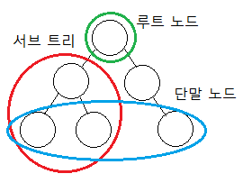

# 🔍 이진 탐색(Binary Search) 알고리즘

> 탐색 알고리즘 중 가장 기본적인 순차 탐색과 이진 탐색을 알아보자.

- 순차 탐색(Sequential Search) : 원하는 데이터를 찾기 위해 해당 리스트의 시작 위치의 데이터부터 하나씩 비교해가며 찾는 방법이다.
- 이진 탐색(Binary Search) : 원하는 데이터를 찾기 위해 해당 리스트의 중간 위치의 데이터와 비교를 반복하며 찾는 방법이다.

 

> N개의 데이터가 있을 때 위 두 탐색 알고리즘의 효율성 차이는?

먼저, 순차 탐색의 최악의 경우는 찾는 데이터가 리스트의 끝에 있거나 리스트에 없는 경우이다.

    리스트의 시작 위치의 데이터부터 하나씩 비교하여 N개의 데이터를 모두 비교하게 된다.

    따라서, 최악의 경우 시간 복잡도는 "O(N)"이 된다.

다음으로, 이진 탐색의 최악의 경우는 찾는 데이터가 리스트에 없거나 리스트의 데이터가 1개 남을 때까지 반복하는 경우이다.

    리스트의 중간 위치의 데이터와 비교를 거치면서 리스트의 비교할 데이터가 반씩 감소한다.
    N개의 데이터가 반씩 감소하여 1개가 남았을 때까지의 분할 횟수 K를 구하면
    N * (1/2)^K = 1와 같은 식에 의해 K = logN이다.(밑이 2인 log를 의미)
    매회 비교 연산은 1회 발생한다.(찾는 데이터와 중간 데이터의 비교)

    따라서, 최악의 경우 시간 복잡도는 "O(logN)"이 된다.

결과적으로, "**이진 탐색**"이 순차 탐색에 비해 데이터를 "**찾는 속도가 매우 빠르다**"는 것을 알 수 있다.

 

> 그럼, 항상 이진 탐색을 사용하면 되지 않을까?!

아쉽지만, **이진 탐색 사용**을 위해서는 "**데이터가 정렬된 상태**"로 있어야 한다. 
그 이유는 이진 탐색은 매회 중간 값과 비교를 통해 리스트에서 찾는 데이터가 속한 위치를 선택해야 하기 때문이다.

 

# 💡 이진 탐색 알고리즘 동작 과정

출처: [skilled.dev](https://skilled.dev/course/searching-and-binary-search)

- [이진 탐색(Binary Search)](reference/binary_search.py) 

1. 해당 리스트의 중간 위치를 구한다.
2. 찾는 값과 중간 위치의 값을 비교하여 찾는 값이 작으면 중간 위치를 기준으로 리스트의 좌측을, 크면 우측을 선택한다.
3. 원하는 값을 찾거나 리스트에 없는 것을 확인할 때까지 1, 2번 과정을 반복한다.

 

> 추가로, 이진 탐색 트리(Binary Search Tree)를 살펴보자.

이진 탐색 트리는 이진 탐색을 수행할 수 있는 트리 형태의 자료 구조이다. 
이진 탐색 트리는 아래 그림과 같은 모든 서브 트리에 대해 항상 "B < A < C"를 만족한다. 

즉, **이진 탐색 트리**를 구성하기 위해서는 "**좌측 자식 노드(B) < 부모 노드(A) < 우측 자식 노드(C)**"를 만족해야 한다.

> 다음 그림에서 좀 더 자세한 동작 과정을 확인할 수 있다!

출처: [김은지님 깃허브](http://ejklike.github.io/2018/01/09/traversing-a-binary-tree-1.html)

