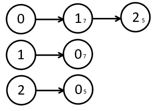

# 🔎 DFS & BFS 알고리즘

DFS(Depth First Search) 알고리즘은 "**깊이 우선 탐색**"이라 하며, 그래프의 깊은 노드부터 우선적으로 탐색하는 방법이다. 

BFS(Breath First Search) 알고리즘은 "**너비 우선 탐색**"이라 하며, 그래프의 인접한 노드부터 우선적으로 탐색하는 방법이다.

 

# 💡 DFS와 BFS의 동작 과정

  

출처: [이코테\_DFS_BFS by나동빈님](https://www.youtube.com/watch?v=PqzyFDUnbrY&list=PLRx0vPvlEmdBFBFOoK649FlEMouHISo8N&index=3)

> 방문한 노드를 재방문하지 않기 위해 방문 처리를 로직을 수행한다.

- [DFS](reference/dfs.py)

1. 탐색을 시작할 노드를 스택에 넣고 방문 처리를 한다.
2. 스택의 최상단 노드에 방문하지 않은 인접 노드가 있으면 스택에 넣고 방문 처리하고, 없으면 스택의 최상단 노드를 꺼낸다.
3. 2번 과정을 더 이상 수행할 수 없을 때까지 반복한다.

- [BFS](reference/bfs.py)

1. 탐색을 시작할 노드를 큐에 넣고 방문 처리를 한다.
2. 큐에서 노드를 꺼내 해당 노드와 인접한 노드 중 방문하지 않은 노드를 모두 큐에 넣고 방문 처리 한다.
3. 2번 과정을 더 이상 수행할 수 없을 때까지 반복한다.

 

# 📌 문제 파악 포인트

> 문제를 풀며 생각해본 내용이므로 잘못된 부분에 대한 조언은 언제든지 환영합니다.😀

- 2차원 배열에서 인접한 좌표에 대해 탐색을 요구한다 
  - 단순 영역 탐색 == DFS, BFS
  - 이동 간 가중치가 일정한 최단 경로 탐색 == BFS

* 좀 더 문제를 접한 후 추가 예정...

 

# 📚 선수 지식

> 위 알고리즘을 이해하기 위해 필요한 추가 정의를 알아보자. 

🔸 **자료구조**(Data Structure)란 연관성있는 데이터를 쉽게 관리하고 처리하기 위해 모아놓은 "**데이터 집합**"을 의미한다. 

🔸 **탐색**(Search)은 이러한 자료구조에서 "**원하는 데이터를 찾는 과정**"을 의미한다. 

🔸 [**스택**(Stack)](reference/stack.py)이란 FILO(First In Last Out) 또는 LIFO(Last In First Out) 구조로 "**먼저 들어온 데이터가 가장 나중에 나가는**" 자료구조이다. 
👉 예) 웹 사이트에서 뒤로가기를 통해 이전 페이지로 이동하는 경우 

🔸 [**큐**(Queue)](reference/queue.py)란 FIFO(First In First Out) 또는 LILO(Last In Last Out) 구조로 "**먼저 들어온 데이터가 가장 먼저 나가는**" 자료구조이다. 
👉 예) 운영체제에서 프로세스를 스케줄링하는 경우  

🔸 **그래프**(Graph)는 각 **노드**(Node) 또는 정점(Vertex)들이 **간선**(Edge)으로 **연결**된 자료구조이다. 
👉 예) 리눅스 시스템의 디렉토리 구조 

#### 🔹 그래프의 구현 2가지 방식

- [인접 행렬(Adjacency Matrix)](reference/graph_matrix.py) : 2차원 배열로 그래프의 연결 관계를 표현

  

|       |  0  |  1   |  2   |
| :---: | :-: | :--: | :--: |
| **0** |  0  |  7   |  5   |
| **1** |  7  |  0   | 무한 |
| **2** |  5  | 무한 |  0   |

 

- [인접 리스트(Adjacency List)](reference/graph_list.py) : 리스트로 그래프의 연결 관계를 표현

  

  |     노드     | 대상 노드와 가중치를 포함한 리스트 |
  | :----------: | :--------------------------------: |
  | **graph[0]** |          [(1, 7), (2, 5)]          |
  | **graph[1]** |              [(0, 7)]              |
  | **graph[2]** |              [(0, 5)]              |

 

> 위 그래프를 표현하는 두 방식의 효율성 차이를 살펴보자!!😆 

노드의 개수가 V, 간선의 개수가 E인 그래프를 가정하면 
(시간 효율은 특정 노드에서 다른 노드로 연결된 비용을 찾는 시간을 의미한다.)

1. 인접 행렬

   - 메모리 효율 : O(V²) (각 노드마다 모든 노드와 연결 관계를 저장)
   - 시간 효율 : O(1) (모든 노드의 연결 관계를 가지고 있으므로)

2. 인접 리스트
   - 메모리 효율 : O(E) (각 노드마다 인접 노드의 연결 관계만 저장)
   - 시간 효율 : O(V) (특정 노드에 연결된 노드 정보를 하나씩 확인해야 하므로)

간선에 방향성이 있다고 가정해도 간선의 수(E)는 노드 수(V)에서 2개를 선택하는 순열과 같으므로 E = vP₂ = v(v-1)이고 E < V²을 만족한다. 
따라서, 두 방식의 효율성은 다음과 같다.

    1. 메모리 효율성 : 인접 행렬 < 인접 리스트
    2. 속도 효율성 : 인접 행렬 > 인접 리스트

> 그럼 어떤 방식을 선택하는 것이 좋을까...?😅 

역시 주어진 상황에 알맞은 방식을 선택하는 것이 맞는 것 같다. 
가령, 특정 노드와 연결된 모든 인접 노드를 순회해야하는 상황이면 속도 측면에서 두 방식의 차이가 적으므로 메모리 효율이 우수한 인접 리스트가 인접 행렬보다 좋은 선택이 되는 것처럼...
