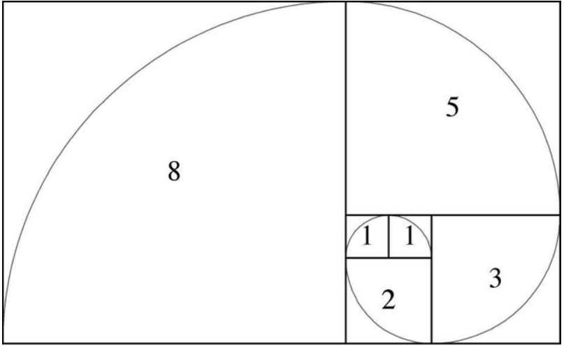
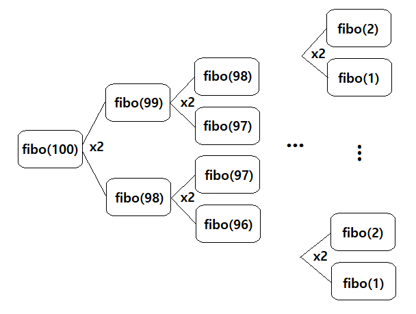
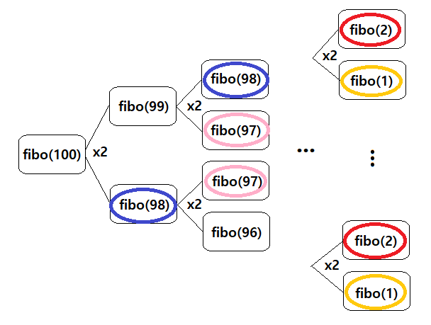
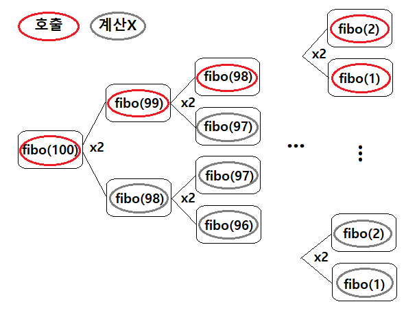

# ⛓ 다이나믹 프로그래밍(Dynamic Programming) 알고리즘

다이나믹 프로그래밍은 특정 문제 상황에서 메모리 공간을 조금 더 사용하여 연산 속도를 크게 향상시킬 수 있는 대표적인 방법 중 하나이다. 

**다이나믹 프로그래밍**은 **큰 문제를 작은 문제들로 나누고, 같은 문제에 대해선 한 번만 풀이**하여 문제를 효율적으로 해결하는 알고리즘 기법이다. 

따라서, 다이나믹 프로그래밍을 사용하기 위해서는 다음 조건들을 만족해야 한다.

    1. 하나의 큰 문제를 여러 개의 작은 부분 문제로 나누어 생각할 수 있다.
    2. 작은 문제에서 구한 결과 값은 그것을 포함하는 큰 문제에서도 동일한 값을 지닌다.

 

> 분할 정복 알고리즘 vs 다이나믹 프로그래밍

대표적인 분할 정복(Divide and Conquer) 알고리즘에는 "퀵 정렬"과 "이진 탐색" 알고리즘이 있다. 

어떤 문제를 작은 단위로 분할하며 해결한다는 측면에서는 다이나믹 프로그래밍과 유사하다고 볼 수 있지만, 다이나믹 프로그래밍은 분할한 문제들이 서로 영향을 준다는 점에서 차이가 있다.

 

# 💡 다이나믹 프로그래밍의 구현 과정

> 가장 대표적인 예시인 피보나치 수열을 통해 다이나믹 프로그래밍을 알아보자.

피보나치(fibonacci) 수열 : 첫 번째와 두 번째 항의 값이 1로 시작하여 다음 항의 값이 이전 두 항의 값의 합으로 결정되는 특징을 지닌 수열이다.

피보나치 수열은 다음 그림과 같이 안에서 밖으로 나가며 굽어지는 나선 형태로 표현할 수 있고 이를 피보나치 나선이라고 한다.

위 그림의 숫자는 각 정사각형의 한 변의 길이를 의미한다.

피보나치 수열을 점화식으로 나타내면 아래와 같고 이는 [재귀 함수를 이용한 방법](reference/fibonacci.py)으로 간단히 구현할 수 있다.

    a₁ = 1, a₂ = 1
    a[n] = a[n-1] + a[n-2] (n > 2)

그러나, 위 링크되어 있는 코드와 같이 재귀 함수를 이용하여 구현한 일반적인 방법에는 치명적인 문제점이 있다. 그건 바로 구하고자 하는 항(N)의 번호가 조금만 커져도 결과 값을 계산하는 시간이 기하급수적으로 올라간다는 점이다. 

이는 피보나치 수열을 재귀 함수로 구현했을 때의 시간 복잡도와 관련이 있다. 
위 코드의 시간 복잡도를 알아보기 위해 100번째 항을 구하는 과정을 아래와 같이 도식화하였다.

위 그림에서 알 수 있듯이 각 단계를 거칠 때마다 호출되는 재귀 함수의 수가 2배씩 증가하고 있다. 
따라서, 이를 일반화하면 <strong>시간 복잡도는 O(2ⁿ­­­)</strong>이라고 할 수 있다. 

2^10을 약 1,000이라 하면 n = 100 즉, 100번째 항을 구하기 위한 연산 횟수는 (2^10)^10 = (1000)^10이므로 
약 1,000,000,000,000,000,000,000,000,000,000번의 연산이 필요하다. 일반적인 컴퓨터가 1초에 1억번 정도의 연산을 한다고 가정할 때 100번째 항을 구하기 위해서는 약 317,097,919,837,645년이라는 어마어마한 시간이 소요된다는 것을 알 수 있다.

 

> 그럼, 이제 다이나믹 프로그래밍을 적용하여 위 알고리즘의 시간 복잡도를 개선해보자.

위 도식화한 그림을 살펴보면 다음과 같이 반복적으로 호출되는 함수들을 발견할 수 있다.

위 그림처럼 반복되어 호출되는 동일한 함수들은 몇 번이 호출되든지 상관없이 항상 같은 값을 갖는다. 그러므로, 동일한 함수를 매번 호출할 때마다 그 값을 계산할 것이 아니라 **한 번 호출 시 계산 값을 메모리에 저장**해놓고 이후 **다시 호출되었을 때** 그 값을 단순히 **메모리에서 읽어오는 것**으로 해당 알고리즘의 수행 연산 횟수를 크게 줄일 수 있다. 

다이나믹 프로그래밍에서 사용하는 위 같은 기법을 <strong>메모이제이션(Memoization)</strong>이라고 하며, 값을 저장하고 읽어오는 방법을 사용하므로 캐싱(caching)이라고도 한다.

 

> 그럼, 메모이제이션 기법을 사용한 [개선된 피보나치 수열 알고리즘](reference/dp_fibonacci.py)의 시간 복잡도는 어떻게 될까??

상단의 우측 그림과 같이 한 번 계산한 결과는 다시 계산하지 않으며, 실제 호출되는 함수를 확인해보면 N번째 항에 대한 <strong>시간 복잡도는 O(N)</strong>이라는 것을 알 수 있다.

 

> 다이나믹 프로그래밍에는 다음 2가지 구현 방식이 존재한다.

1.  **탑-다운(Top-Down)** : **큰 문제를 해결하기 위해 작은 문제들을 호출**하며 문제를 해결하는 방법이다. 
    하향식 방법이며, 위 메모이제이션 기법은 탑-다운 방식에만 사용하는 표현이다. 

    예) 위 개선된 피보나치 수열 알고리즘의 재귀 함수 방식 (특정 항의 값을 구하기 위해 이전 작은 항들을 반복하여 호출한다.)

2.  **보텀-업(Bottom-Up)** : **작은 문제부터 하나씩 해결하고 올라가며** 문제를 해결하는 방법이다. 
    상향식 방법이며, 이 방식에 사용하는 결과 값을 저장하는 리스트나 배열을 "**DP 테이블**"이라고 한다. 
    일반적으로 다이나믹 프로그래밍의 구현은 보텀-업 방식을 많이 사용한다.

    예) 위 개선된 피보나치 수열 알고리즘의 반복문을 이용한 방식

 

# 📌 문제 해결 포인트

먼저, 주어진 문제가 다이나믹 프로그래밍 유형임을 파악하기 위해 다음 2가지를 확인한다.

1. **해당 문제를 중복되는 부분 문제들로 나눌 수 있는지**
2. **부분 문제의 결과 값이 해당 문제에서도 동일한 값을 가지는지**

해당 문제가 다이나믹 프로그래밍 유형임을 파악했다면 문제 해결을 위해 **일정한 규칙을 파악해서 임의의 항에 대한 점화식**을 세우도록 하자.

🔹 Tip. 특정 문제를 완전 탐색 알고리즘으로 접근 시 수행 시간이 너무 오래 걸리면 다이나믹 프로그래밍을 적용할 수 있는지 살펴보자!!
