# 📈 기타 그래프(Graph) 알고리즘

> 먼저, 앞서 살펴봤던 내용들을 다시 정리해보자!

그래프(Graph)는 노드(Node)와 간선(Edge)으로 이루어진 자료구조로 구현 방법에는 다음 2가지 방식이 있었다. 

1. [인접 행렬](../DFS_BFS/reference/graph_matrix.py)
2. [인접 리스트](../DFS_BFS/reference/graph_list.py)

이를 이용해 해결했던 [DFS/BFS](../DFS_BFS/DFS_BFS.md)와 [최단 경로](../Shortest_Path/SHORTEST_PATH.md) 알고리즘도 그래프 알고리즘의 한 유형에 해당한다고 볼 수 있다.

 

> 다음으로, 이후 다룰 그래프 알고리즘에 필요한 자료 구조를 알아보자!

🔸 **[서로소 집합 자료구조(Disjoint Sets)](./reference/disjoint_sets.py)** : **원소들이 서로소인 부분 집합들**로 나누어져 있는 자료구조이다. 
cf. 서로소란 '공통된 원소가 없는 두 집합'을 의미한다. 예를 들어 [1, 2]와 [7, 8]은 서로소다.

- '<strong>_합집합(union)_</strong>'과 '<strong>_찾기(find)_</strong>'연산이 제공되며, union-find(합치기 찾기) 자료구조라고도 한다. 

* 트리를 이용한 서로소 집합의 계산 과정을 요약하면 다음과 같다.

       1. 서로 연결할 두 노드 A, B에 대해 union(합집합)연산을 수행한다.
         a. A와 B의 루트 노드 A', B'를 각각 찾는다.
         b. A'를 B'의 부모 노드로 설정한다. (A' ← B')
         (A'와 B' 중 더 작은 값이 부모 노드가 된다, 수행 결과 B의 루트 노드는 A'가 된다.)
       2. 모든 union(합집합) 연산을 처리할 때까지 1번 과정을 반복한다.

 

> 아래 그림과 같은 서로소 집합 자료구조를 생성하는 과정을 살펴보자.

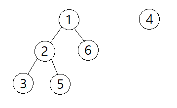

🔹 Step 0. 부모 테이블을 각 노드의 자기자신 값으로 초기화한다.

| 노드 |  1  |  2  |  3  |  4  |  5  |  6  |
| :--: | :-: | :-: | :-: | :-: | :-: | :-: |
| 부모 |  1  |  2  |  3  |  4  |  5  |  6  |

 

🔹 Step 1. union 1, 6

- 노드 1의 루트 노드 : 1
- 노드 6의 루트 노드 : 6

따라서, 노드 6의 루트 노드의 부모 노드를 1로 설정한다.

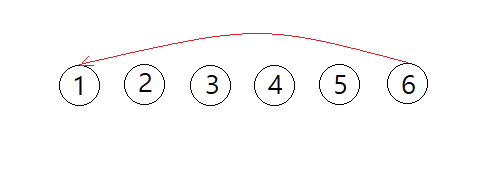

| 노드 |  1  |  2  |  3  |  4  |  5  |    6    |
| :--: | :-: | :-: | :-: | :-: | :-: | :-----: |
| 부모 |  1  |  2  |  3  |  4  |  5  | **_1_** |

 

🔹 Step 2. union 2, 3

- 노드 2의 루트 노드 : 2
- 노드 3의 루트 노드 : 3

따라서, 노드 3의 루트 노드의 부모 노드를 2로 설정한다.

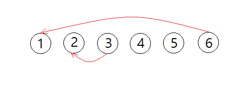

| 노드 |  1  |  2  |    3    |  4  |  5  |  6  |
| :--: | :-: | :-: | :-----: | :-: | :-: | :-: |
| 부모 |  1  |  2  | **_2_** |  4  |  5  |  1  |

 

🔹 Step 3. union 3, 5

- 노드 3의 루트 노드 : 2
- 노드 5의 루트 노드 : 5

따라서, 노드 5의 루트 노드의 부모 노드를 2로 설정한다.

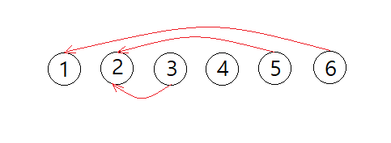

| 노드 |  1  |  2  |  3  |  4  |    5    |  6  |
| :--: | :-: | :-: | :-: | :-: | :-----: | :-: |
| 부모 |  1  |  2  |  2  |  4  | **_2_** |  1  |

 

🔹 Step 4. 마지막 union 6, 2

- 노드 6의 루트 노드 : 1
- 노드 2의 루트 노드 : 2

따라서, 노드 2의 루트 노드의 부모 노드를 1로 설정한다.

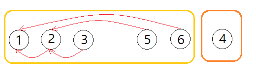

| 노드 |  1  |    2    |  3  |  4  |  5  |  6  |
| :--: | :-: | :-----: | :-: | :-: | :-: | :-: |
| 부모 |  1  | **_1_** |  2  |  4  |  2  |  1  |

  

> 서로소 집합 자료구조를 구현하는 알고리즘의 효율성

상단의 *서로소 집합 자료구조*에 링크되어 있는 소스 코드를 살펴보면 2가지 방식으로 find함수가 구현된 것을 알 수 있다. 이로부터 알고리즘의 효율성을 생각해보자.

먼저, {1, 2, 3, 4, 5} 5개의 원소를 지닌 집합에 union 연산이 (4, 5), (3, 4), (2, 3), (1, 2) 순서로 주어져 모두 연결된 상황을 가정하면 다음과 같은 부모 테이블이 만들어진다.

| 노드 |  1  |  2  |  3  |  4  |  5  |
| :--: | :-: | :-: | :-: | :-: | :-: |
| 부모 |  1  |  1  |  2  |  3  |  4  |

이때, 각 find 함수를 호출하여 노드 5의 루트 노드를 찾는 과정을 살펴보면

1. 일반적인 재귀 방식 find : 
   5 > 4 > 3 > 2 > 1 순으로 거슬러 올라가며 루트 노드를 찾는다. 매번 동일한 과정을 반복하기 때문에 노드의 개수가 V라면 해당 연산의 수행 시간은 O(V)이고, 주어진 find나 union 연산의 수가 M일 때 전체 시간 복잡도는 O(VM)이 된다.
   (union연산 내에서 find연산을 수행하므로)

2. 경로 압축(Path Compression)을 이용한 find : 
   이 기법 역시 첫 호출 시 루트 노드를 찾는 과정은 1번과 동일하지만, 그 과정에서 각 노드의 부모 테이블이 갱신된다. 따라서, 해당 노드의 루트 노드가 변경되지 않는 한 이후 호출부터는 루트 노드를 바로 알 수 있다. 노드의 수가 V, find나 union 연산의 수가 M일 때 이에 대한 시간 복잡도는 대략 O(V + Mlog₂V)정도로 이해하면 된다.

 

> 그럼, 이 자료구조는 언제 사용하는 걸까...?🤔

🔹 <strong>_무방향 그래프_</strong>가 주어졌을 때 서로소 집합 자료구조는 '**집합의 분할을 모델링**'하여 다음 정보를 알 수 있다. 

1. 연결된 요소들을 추적
2. 두 정점이 같은 집합에 속하는지 판별
3. [사이클(폐쇄 루프)이 존재하는지 판별](./reference/disjoint_sets_cycle.py)

 

🔸 <strong>신장 트리(Spanning Tree)</strong> : 하나의 그래프가 있을 때 **그래프 내 모든 노드를 포함하면서 사이클이 발생하지 않는 부분 그래프**를 의미한다.

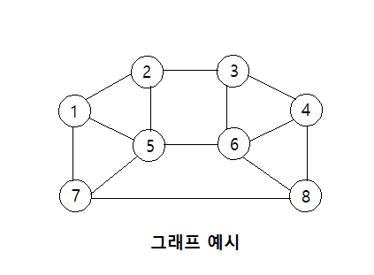
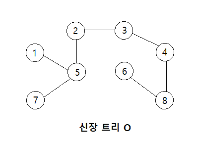 
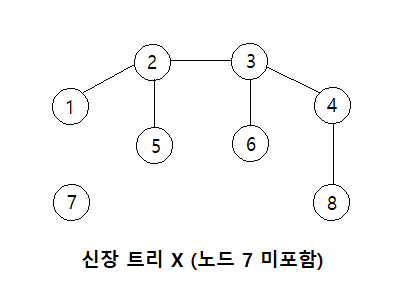
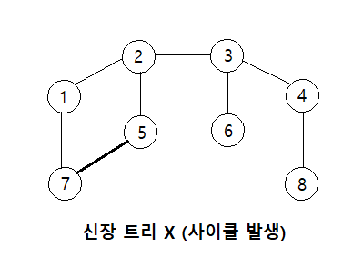

 

> 이제, 다른 기타 그래프 알고리즘에 대해 살펴보도록 하자!

  

# 🔸 크루스칼(Kruskal) 알고리즘

**크루스칼 알고리즘은 최소 신장 트리를 찾아내는 대표적인 알고리즘**이다. 여기서, **최소 신장 트리**란 신장 트리 중에서 <strong>_최소한의 비용으로 만들 수 있는 신장 트리_</strong>를 의미한다.

 

🔹 크루스칼 알고리즘의 동작 과정은 다음과 같다.

1. 간선의 비용을 기준으로 간선 데이터를 오름차순으로 정렬한다.
2. 모든 간선을 하나씩 순회하며 현재 간선이 사이클을 발생시키는지 확인한다. 
   if. 사이클이 발생하지 않으면 최소 신장 트리에 포함시킨다.(두 노드의 union연산) 
   else. 사이클이 발생하면 최소 신장 트리에서 제외한다.

 

> 다음은 주어진 그래프에서 [크루스칼 알고리즘](reference/kruskal.py)으로 최소 신장 트리를 구하는 과정이다.

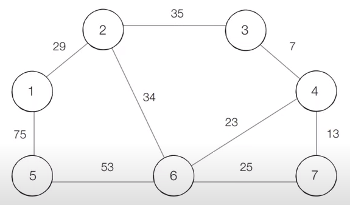

출처: [이코테\_기타\_Graph by나동빈님](https://www.youtube.com/watch?v=aOhhNFTIeFI&list=TLPQMjIwNTIwMjFA1dDigixgEQ&index=2)

🔹 Step 0️. 간선 데이터를 간선의 비용을 기준으로 오름차 정렬한다.

| 간선 | (3, 4) | (4, 7) | (4, 6) | (6, 7) | (1, 2) | (2, 6) | (2, 3) | (5, 6) | (1, 5) |
| :--: | :----: | :----: | :----: | :----: | :----: | :----: | :----: | :----: | :----: |
| 비용 |   7    |   13   |   23   |   25   |   29   |   34   |   35   |   53   |   75   |

 

🔹 Step 1 - 9. 낮은 비용의 간선부터 하나씩 확인하며 최소 신장 트리에 포함 여부를 결정한다. 
(사이클이 발생하는 단계는 4, 7, 9단계이며, 각 간선의 비용은 25, 35, 75이다.)

| 간선 | (3, 4) | (4, 7) | (4, 6) | ~~(6, 7)~~ | (1, 2) | (2, 6) | ~~(2, 3)~~ | (5, 6) | ~~(1, 5)~~ |
| :--: | :----: | :----: | :----: | :--------: | :----: | :----: | :--------: | :----: | :--------: |
| 비용 |   7    |   13   |   23   |   ~~25~~   |   29   |   34   |   ~~35~~   |   53   |   ~~75~~   |

 

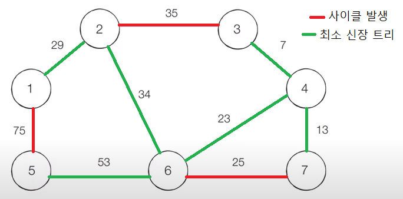 

 

> 크루스칼 알고리즘의 효율성

크루스칼 알고리즘에서 가장 많은 연산이 요구되는 부분은 주어진 간선들을 비용에 따라 오름차순으로 정렬할 때이다. 따라서, 주어진 간선의 수가 E라 할 때 크루스칼 알고리즘의 시간 복잡도는 O(ElogE)라 할 수 있다.

  

# 🔸 위상 정렬(Topology Sort) 알고리즘

**위상 정렬은 방향 그래프의 모든 노드를 방향성에 거스르지 않게 순서대로 나열하는 알고리즘**으로 순서가 정해져 있는 작업을 차례로 수행해야 할 때 사용할 수 있다. 

ex) 선수과목을 고려한 학습 순서 설정

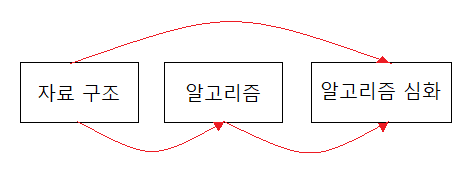 

위상 정렬 알고리즘에는 <strong>_진입차수(Indegree)_</strong>라는 개념이 있는데, 이는 <strong>_특정 노드로 들어오는 간선의 수_</strong>를 의미한다.
위 예시에서 '알고리즘 심화' 과목의 진입차수는 2이다. (선수과목으로 '자료구조'와 '알고리즘' 2개가 있으므로)

 

🔹 위상 정렬 알고리즘의 동작 과정은 다음과 같다.

1. 진입차수가 0인 노드를 큐에 넣는다.
2. 큐에서 원소를 꺼내 해당 노드에서 출발하는 간선을 그래프에서 제거하여 목적지 노드의 진입차수를 감소시킨다.
3. 큐가 빌 때까지 1, 2 과정을 반복한다.

이때, 모든 노드를 방문하기 전에 큐가 빈다면 사이클이 존재한다고 판단할 수 있다.

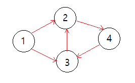

위와 같이 사이클이 존재하는 그래프를 생각해보면 1번 노드에 대해서 1, 2번 과정을 수행하면 이후 진입차수가 0이 되는 노드가 존재하지 않기 때문에 모든 노드를 방문하기 전에 큐가 빈 상태가 되는 것을 알 수 있다.

 

> 다음은 주어진 그래프에서 [위상 정렬 알고리즘](reference/topology_sort.py)을 수행하는 과정이다.

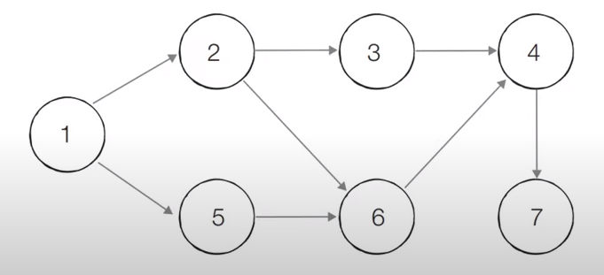

출처: [이코테\_기타\_Graph by나동빈님](https://www.youtube.com/watch?v=aOhhNFTIeFI&list=TLPQMjIwNTIwMjFA1dDigixgEQ&index=2)

먼저, 노드 별 진입차수 테이블은 아래와 같다.

|   노드   |  1  |  2  |  3  |  4  |  5  |  6  |  7  |
| :------: | :-: | :-: | :-: | :-: | :-: | :-: | :-: |
| 진입차수 |  0  |  1  |  1  |  2  |  1  |  2  |  1  |

 

🔹 Step 0️. 진입차수가 0인 노드 1을 큐에 넣는다.

|   노드   |  1  |  2  |  3  |  4  |  5  |  6  |  7  |
| :------: | :-: | :-: | :-: | :-: | :-: | :-: | :-: |
| 진입차수 |  0  |  1  |  1  |  2  |  1  |  2  |  1  |
|  Queue   |  1  |

 

🔹 Step 1. 큐에서 노드1을 제거하고 해당 노드에 연결된 간선을 그래프에서 제거한다. 이후 새로 진입차수가 0이 된 노드 2와 5를 큐에 넣는다. (두 노드 중 어떤 것을 먼저 넣어도 상관없다.)

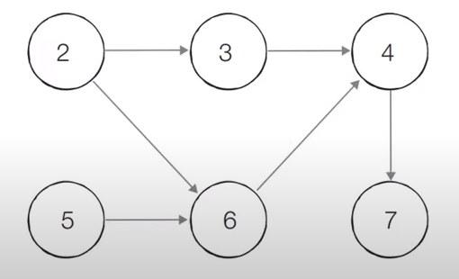

|   노드   |  1  |  2  |  3  |  4  |  5  |  6  |  7  |
| :------: | :-: | :-: | :-: | :-: | :-: | :-: | :-: |
| 진입차수 |  0  |  0  |  1  |  2  |  0  |  2  |  1  |
|  Queue   |  2  |  5  |

 

🔹 Step 2. 큐에서 노드2을 제거하고 해당 노드에 연결된 간선을 그래프에서 제거한다. 이후 새로 진입차수가 0이 된 노드 3을 큐에 넣는다.

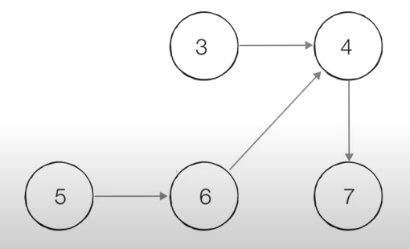

|   노드   |  1  |  2  |  3  |  4  |  5  |  6  |  7  |
| :------: | :-: | :-: | :-: | :-: | :-: | :-: | :-: |
| 진입차수 |  0  |  0  |  0  |  2  |  0  |  1  |  1  |
|  Queue   |  5  |  3  |

 

🔹 Step 3. 큐에서 노드5를 제거하고 해당 노드에 연결된 간선을 그래프에서 제거한다. 이후 새로 진입차수가 0이 된 노드 6을 큐에 넣는다.

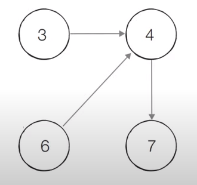

|   노드   |  1  |  2  |  3  |  4  |  5  |  6  |  7  |
| :------: | :-: | :-: | :-: | :-: | :-: | :-: | :-: |
| 진입차수 |  0  |  0  |  0  |  2  |  0  |  0  |  1  |
|  Queue   |  3  |  6  |

 

🔹 Step 4. 큐에서 노드3을 제거하고 해당 노드에 연결된 간선을 그래프에서 제거한다.

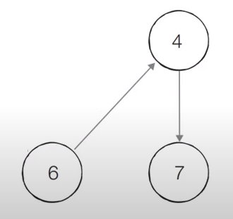

|   노드   |  1  |  2  |  3  |  4  |  5  |  6  |  7  |
| :------: | :-: | :-: | :-: | :-: | :-: | :-: | :-: |
| 진입차수 |  0  |  0  |  0  |  1  |  0  |  0  |  1  |
|  Queue   |  6  |

 

🔹 Step 5. 큐에서 노드6을 제거하고 해당 노드에 연결된 간선을 그래프에서 제거한다. 이후 새로 진입차수가 0이 된 노드 4를 큐에 넣는다.

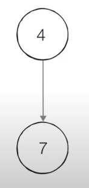

|   노드   |  1  |  2  |  3  |  4  |  5  |  6  |  7  |
| :------: | :-: | :-: | :-: | :-: | :-: | :-: | :-: |
| 진입차수 |  0  |  0  |  0  |  0  |  0  |  0  |  1  |
|  Queue   |  4  |

 

🔹 Step 6. 큐에서 노드4을 제거하고 해당 노드에 연결된 간선을 그래프에서 제거한다. 이후 새로 진입차수가 0이 된 노드 7을 큐에 넣는다.

|   노드   |  1  |  2  |  3  |  4  |  5  |  6  |  7  |
| :------: | :-: | :-: | :-: | :-: | :-: | :-: | :-: |
| 진입차수 |  0  |  0  |  0  |  0  |  0  |  0  |  0  |
|  Queue   |  7  |

 

🔹 마지막으로, 큐에서 노드7을 제거하고 큐가 비었으므로 알고리즘을 종료한다.

|   노드   |  1  |  2  |  3  |  4  |  5  |  6  |  7  |
| :------: | :-: | :-: | :-: | :-: | :-: | :-: | :-: |
| 진입차수 |  0  |  0  |  0  |  0  |  0  |  0  |  0  |
|  Queue   |     |

### - 순회 결과 : 1 > 2 > 5 > 3 > 6 > 4 > 7 (또는 1 > 5 > 2 > 3 > 6 > 4 > 7)
