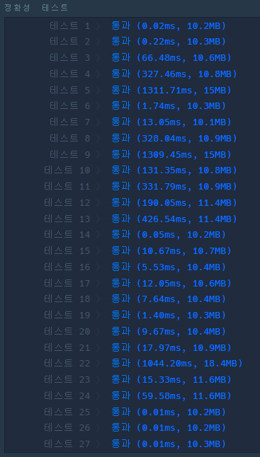
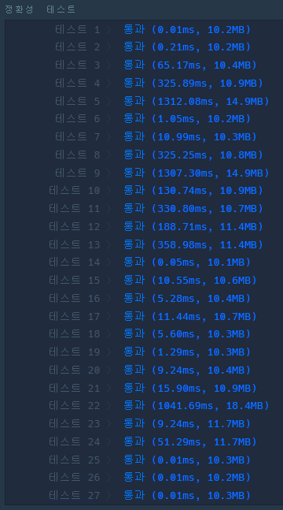

# ❌ 실패율

## 🔸 My 풀이 과정

- ### 풀이 아이디어

  각 스테이지의 실패율을 구해서 내림차 순으로 정렬한 후 그에 해당하는 스테이지 번호를 순차적으로 출력하면 되는 간단한 문제이다. 각 스테이지의 실패율은 주어진 stages 리스트에서 해당 스테이지를 진행하는 플레이어의 수를 구한 후 해당 스테이지 이상의 스테이지를 진행 중인 플레이어들의 수의 합으로 나누어주면 구할 수 있다.

- ### 소스 코드

  위 알고리즘으로 [직접 구현한 소스 코드](my_failure_rate.py)

- ### 알고리즘 동작 과정

  1. 주어진 stages 리스트에서 각 스테이지별 진행 중인 플레이어의 수를 구한다.
  2. 1번부터 마지막 스테이지까지 순차적으로 실패율을 구하고 실패율과 해당 스테이지 번호를 함께 answer 리스트에 추가한다.
  3. 2번에서 구한 answer 리스트를 실패율에 대해서는 내림차순으로, 스테이지 번호에 대해서는 오름차순으로 정렬한다.
  4. 정렬한 answer 리스트에서 스테이지 번호만으로 이루어진 리스트를 구하여 반환한다.

- ### 실행 결과

  

- ### 코드 결함

  직접 구현했던 코드의 경우 테스트를 모두 통과하긴 했지만, 미완성된 코드라고 볼 수 있다. 그 이유는 실패율을 구하는 부분에서 해당 스테이지에 도달한 플레이어의 수가 0인 경우를 고려하지 않았고 이로인해 ZeroDivisionError가 발생할 가능성이 남아있었기 때문이다.

 

## 🔹 Other 풀이 분석

- 풀이 아이디어는 위와 동일하다고 할 수 있지만, 위 코드와 같은 결함이 존재하지 않았고 실패율 계산 시 해당 스테이지에 도달한 플레이어의 수를 구하는 방법과 실패율을 기준으로 정렬을 수행할 때 딕셔너리의 특성을 이용해 좀 더 간단하게 구현한 점들이 돋보였다.

- ### 소스 코드

  다른 사람들이 구현한 [소스 코드](other_failure_rate.py)

- ### 실행 결과

  
