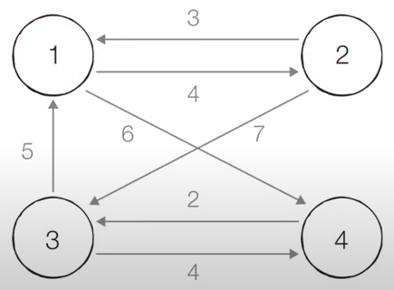

# 🗾 최단 경로(Shortest Path) 알고리즘

**최단 경로 알고리즘**은 말 그대로 주어진 가능한 경로 중 **가장 짧은 경로를 찾아내는** 알고리즘을 의미한다. 

최단 경로 알고리즘은 보통 그래프로 표현하며 각 **지점은** '**노드(node)**'로, 지점 간 **연결된 도로**는 '**간선(Edge)**'으로 표현한다.

> 최단 경로 알고리즘에는 다양한 기법들이 존재하지만 우선 자주 사용되는 다음 2가지를 먼저 학습하도록 하자!!😚

1. [다익스트라(데이크스트라, Dijkstra)](<#🔸다익스트라(Dijkstra)-최단-경로-알고리즘>)
2. [플로이드 워셜(Floyd Warshall)](<#🔸플로이드-워셜(Floyd-Warshall)-알고리즘>)

 

# 🔸다익스트라(Dijkstra) 최단 경로 알고리즘

**다익스트라 알고리즘**은 그래프에 여러 개의 노드가 존재할 때 **특정 노드로부터 다른 노드까지의 최단 경로**를 각각 구하는 알고리즘이다. 

다익스트라 알고리즘은 그래프에 **음의 간선이 없을 떄 정상적으로 동작**하며, 매 단계마다 '비용이 가장 적은 노드'를 선택하여 임의의 과정을 반복하기 때문에 그리디 알고리즘으로 볼 수 있다.

 

🔹 다익스트라 알고리즘의 동작 과정을 요약하면 다음과 같다.

1. 출발 노드를 설정하고 최단 거리를 기록할 테이블을 초기화한다.
2. 최단 경로 테이블에서 방문하지 않은 노드 중 거리가 가장 짧은 노드를 선택한다.
3. 해당 노드를 거쳐 다른 노드로 가는 비용을 계산하여 최단 경로 테이블을 갱신한다.
4. 모든 노드에 대해 2-3번 과정을 반복한다.

 

> 다음 그림을 통해 다익스트라 알고리즘의 동작 과정을 자세히 살펴보자.

출처: [이코테\_Shortest_Path by나동빈님](https://www.youtube.com/watch?v=acqm9mM1P6o)

🔹 Step 0️. 시작 노드를 1로 설정하고 최단 경로 테이블을 초기화한다. 
(INF는 무한 값을 의미하고 방문 처리는 다음과 같이 ~~방문 노드~~ 표시하였다.)

| 노드 |  1  |  2  |  3  |  4  |  5  |  6  |
| :--: | :-: | :-: | :-: | :-: | :-: | :-: |
| 거리 |  0  | INF | INF | INF | INF | INF |

 

🔹 Step 1. 최단 경로 테이블에서 방문하지 않은 노드 중 거리가 가장 짧은 노드는 시작 노드 자기 자신이므로 노드 1을 선택하고, 해당 노드를 거쳐 다른 노드로 가는 비용을 계산하면 다음과 같다. 

- 노드2 : 0 + 2 = 2
- 노드3 : 0 + 5 = 5
- 노드4 : 0 + 1 = 1

위 값들과 최단 경로 테이블의 해당 값들을 비교해 더 적은 값으로 갱신한다.

| 노드 | ~~1~~ |  2  |  3  |  4  |  5  |  6  |
| :--: | :---: | :-: | :-: | :-: | :-: | :-: |
| 거리 | ~~0~~ |  2  |  5  |  1  | INF | INF |

 

🔹 Step 2. 다음으로 거리가 가장 짧은 노드는 4이므로 노드 4를 선택하고, 해당 노드를 거쳐 다른 노드로 가는 비용을 계산하면 다음과 같다. 

- 노드3 : 1 + 3 = 4
- 노드5 : 1 + 1 = 2

위 값들과 최단 경로 테이블의 해당 값들을 비교해 더 적은 값으로 갱신한다.

| 노드 | ~~1~~ |  2  |  3  | ~~4~~ |  5  |  6  |
| :--: | :---: | :-: | :-: | :---: | :-: | :-: |
| 거리 | ~~0~~ |  2  |  4  | ~~1~~ |  2  | INF |

 

🔹 Step 3. 다음으로 거리가 가장 짧은 노드는 2와 5가 있다. 이 경우 어떤 것을 먼저 선택해도 상관없지만 노드 번호가 작은 2를 먼저 선택하겠다. 해당 노드를 거쳐 다른 노드로 가는 비용을 계산하면 다음과 같다. 

- 노드3 : 2 + 3 = 5
- 노드4 : 2 + 2 = 4

위 값들과 최단 경로 테이블의 해당 값들을 비교해 더 적은 값으로 갱신한다.

| 노드 | ~~1~~ | ~~2~~ |  3  | ~~4~~ |  5  |  6  |
| :--: | :---: | :---: | :-: | :---: | :-: | :-: |
| 거리 | ~~0~~ | ~~2~~ |  4  | ~~1~~ |  2  | INF |

 

🔹 Step 4. 다음으로 노드 5를 선택한다. 해당 노드를 거쳐 다른 노드로 가는 비용을 계산하면 다음과 같다. 

- 노드3 : 2 + 1 = 3
- 노드6 : 2 + 2 = 4

위 값들과 최단 경로 테이블의 해당 값들을 비교해 더 적은 값으로 갱신한다.

| 노드 | ~~1~~ | ~~2~~ |  3  | ~~4~~ | ~~5~~ |  6  |
| :--: | :---: | :---: | :-: | :---: | :---: | :-: |
| 거리 | ~~0~~ | ~~2~~ |  3  | ~~1~~ | ~~2~~ |  4  |

 

🔹 Step 5. 다음으로 노드 3을 선택한다. 해당 노드를 거쳐 다른 노드로 가는 비용을 계산하면 다음과 같다. 

- 노드2 : 3 + 3 = 6
- 노드6 : 3 + 5 = 8

위 값들과 최단 경로 테이블의 해당 값들을 비교해 더 적은 값으로 갱신한다.

| 노드 | ~~1~~ | ~~2~~ | ~~3~~ | ~~4~~ | ~~5~~ |  6  |
| :--: | :---: | :---: | :---: | :---: | :---: | :-: |
| 거리 | ~~0~~ | ~~2~~ | ~~3~~ | ~~1~~ | ~~2~~ |  4  |

 

🔹 Step 6. 마지막으로 노드 6을 선택한다. 해당 노드를 거쳐 다른 노드로 가는 경로는 존재하지 않는다. 

(사실, 마지막 노드의 경우 이미 다른 노드들의 최단 경로가 확정되었기 때문에 해당 과정을 수행할 필요가 없다.)

따라서, 노드 1에서 출발하여 각기 다른 노드로 가는 최종 최단 경로는 다음과 같다.

| 노드 |  1  |  2  |  3  |  4  |  5  |  6  |
| :--: | :-: | :-: | :-: | :-: | :-: | :-: |
| 거리 |  0  |  2  |  3  |  1  |  2  |  4  |

 

다음은 위 내용을 파이썬 코드로 구현한 [다익스트라 알고리즘](reference/dijkstra.py)이다. 

위 코드를 확인하면 알 수 있듯이 다익스트라 알고리즘에는 2가지 구현 방법이 있다.

1. 매번 최단 경로 테이블을 탐색하며 최소값을 갖는 노드를 찾는 방법
2. [우선 순위 큐](<#😉우선-순위-큐(Priority-Queue)>)를 이용하여 최소값을 갖는 노드를 꺼내는 방법

> 그럼, 두 방법 중 더 효율적인 방법이 무엇인지 알아보자.

그래프의 노드 수가 V, 간선 수가 E라고 가정하면

**1번 방법**은 각 노드에 대해 매번 V개의 원소를 가진 리스트(최단 경로 테이블)를 탐색해야 하므로 <strong>시간 복잡도가 O(V²)</strong>이 된다.

**2번 방법**은 우선 순위 큐의 삽입과 삭제 연산에 초점을 두고 생각해볼 수 있다. 

먼저, 한 번 처리된(최단 경로가 결정된) 노드는 다시 처리하지 않는다. 즉, 각 노드에 대해 연결된 노드를 확인하는 총 횟수는 총 간선의 수(E)와 같다. 

다음으로, 모든 연결된 노드에 대해 우선 순위 큐에 삽입 및 삭제 연산을 수행한다고 가정하면 이는 E개의 데이터를 모두 힙에 넣고 빼는 과정과 유사하며, 이때의 시간 복잡도는 O(ElogE)이다. 
노드 간 중복 간선을 포함할 경우 vP₂ = V(V - 1), 약 V²이므로 간선의 수(E)는 항상 E ≤ V²를 만족한다. 

따라서, **2번 방법의 시간 복잡도**는 간단히 O(ElogV²)이라고 할 수 있고, 이는 <strong>O(ElogV)</strong>이다. 

일반적으로 E < V² 이므로 O(ElogV) < O(V²)라고 할 수 있고 **2번 방법이 1번 방법에 비해 효율적**이라고 할 수 있다.

 

#### 😉우선 순위 큐(Priority Queue)

- **우선 순위가 높은 데이터를 먼저 삭제**하는 자료구조로 힙(Heap) 자료구조를 이용해 구현한다.

> 힙에 대한 내용은 우선 간략히 살펴보고 추후에 학습 후 보충하도록 하자...😅

🔹 힙을 구현하는 2가지 방식

- 최소 힙 : 값이 작은 데이터를 먼저 삭제
- 최대 힙 : 값이 큰 데이터를 먼저 삭제

🔹 힙 자료구조의 시간 복잡도

|    연산     |  삽입   |  삭제   |
| :---------: | :-----: | :-----: |
| 시간 복잡도 | O(logN) | O(logN) |

> 힙 자료구조의 시간 복잡도는 힙 정렬과 관련이 있을 것 같다...

**TODO List** 
<input type="checkbox"> 힙 자료구조 학습 
<input type="checkbox"> 힙 정렬 학습

 

🔹 Tip. 최소 힙 방식을 최대 힙 방식으로 사용하기 위해 해당 값을 음수(-) 값으로 넣고
이후 우선 순위 큐에서 꺼낼 때 다시 부호를 바꾸어 원래 값으로 변환하는 방법을 사용할 수도 있다.

 

# 🔸플로이드 워셜(Floyd Warshall) 알고리즘

**플로이드 워셜 알고리즘**은 그래프의 **모든 노드 간의 최단 경로**를 모두 구하는 알고리즘이다. 

플로이드 워셜 알고리즘은 모든 노드에 대한 최단 경로를 기록해야 하므로 다익스트라 알고리즘과 달리 2차원 리스트를 최단 경로 테이블로 사용한다. 

또한, 최단 경로 테이블을 갱신하는 과정에서 현재 경로와 각 노드를 거쳐가는 경로를 비교하는 점화식을 수행하기 때문에 다이나믹 프로그래밍으로 볼 수 있다.

 

> 플로이드 워셜 알고리즘의 점화식은 아래와 같이 정의할 수 있다.

노드 x에서 노드 y로 가는 경로를 Dxy라 하고 노드 n을 거쳐간다고 하면

    Dxy = min(Dxy, Dxn + Dny)

 

🔹 플로이드 워셜 알고리즘의 동작 과정을 요약하면 다음과 같다.

1. 모든 노드 간 최단 거리를 기록할 2차원 테이블을 초기화한다.
2. 거쳐 가는 노드를 선택한다.
3. 선택 노드를 제외한 모든 노드를 순회하며, 각 노드에서 출발하여 선택 노드를 통해 다른 모든 노드로 가는 거리를 계산하고 최단 경로 테이블을 갱신한다.
4. 모든 노드에 대해 2-3번 과정을 반복한다.

 

> 플로이드 워셜 알고리즘의 동작 방식에 따른 시간 복잡도를 알아보자.

먼저, N개의 노드에 대해 각 노드가 '거쳐 가는 노드'로 선택되는 횟수는 N번이므로 알고리즘은 총 N번의 단계를 수행한다. 

다음으로, 선택 노드를 거쳐가는 다른 모든 노드 간의 경로를 구하는 연산 횟수는 n-1P₂ = (n-1)(n-2)이므로 O(n²)의 시간 복잡도가 소요된다.

따라서, 총 N번의 단계 동안 O(n²)의 연산을 반복하므로 <strong>플로이드 워셜 알고리즘의 전체 시간 복잡도는 O(n³)</strong>이라고 할 수 있다.

 

> 다음 그림을 통해 플로이드 워셜 알고리즘의 동작 과정을 자세히 살펴보자.

출처: [이코테\_Shortest_Path by나동빈님](https://www.youtube.com/watch?v=acqm9mM1P6o)

🔹 Step 0️. 노드 간 연결되어 있으면 간선 비용으로, 연결되어 있지 않으면 무한 값으로 최단 경로 테이블을 초기화한다. 
(INF는 무한 값을 의미하고 2차원 리스트의 D₁₂값은 1에서 2로 가는 최단 거리를 의미한다.)

| 출발 \ 도착 |  1  |  2  |  3  |  4  |
| :---------: | :-: | :-: | :-: | :-: |
|      1      |  0  |  4  | INF |  6  |
|      2      |  3  |  0  |  7  | INF |
|      3      |  5  | INF |  0  |  4  |
|      4      | INF | INF |  2  |  0  |

 

🔹 Step 1. 1번 노드를 거쳐가는 노드로 선택하고 다른 모든 노드 간의 이동 거리를 계산하여 최단 경로 테이블을 갱신한다. 

- D₂₃ = min(D₂₃, D₂₁ + D₁₃) = min(7, 3 + INF) => 갱신X
- D₂₄ = min(D₂₄, D₂₁ + D₁₄) = min(INF, 3 + 6) => 9로 갱신
- D₃₂ = min(D₃₂, D₃₁ + D₁₂) = min(INF, 5 + 4) => 9로 갱신
- D₃₄ = min(D₃₄, D₃₁ + D₁₄) = min(4, 5 + 6) => 갱신X
- D₄₂ = min(D₄₂, D₄₁ + D₁₂) = min(INF, INF + 4) => 갱신X
- D₄₃ = min(D₄₃, D₄₁ + D₁₃ ) = min(2, INF + INF) => 갱신X

| 출발 \ 도착 |  1  |  2  |  3  |  4  |
| :---------: | :-: | :-: | :-: | :-: |
|      1      |  0  |  4  | INF |  6  |
|      2      |  3  |  0  |  7  |  9  |
|      3      |  5  |  9  |  0  |  4  |
|      4      | INF | INF |  2  |  0  |

 

🔹 Step 2. 2번 노드를 거쳐가는 노드로 선택하고 다른 모든 노드 간의 이동 거리를 계산하여 최단 경로 테이블을 갱신한다. 

- D₁₃ = min(D₁₃, D₁₂ + D₂₃) = min(INF, 4 + 7) => 11로 갱신
- D₁₄ = min(D₁₄, D₁₂ + D₂₄) = min(6, 4 + 9) => 갱신X
- D₃₁ = min(D₃₁, D₃₂ + D₂₁) = min(5, 9 + 3) => 갱신X
- D₃₄ = min(D₃₄, D₃₂ + D₂₄) = min(4, 9 + 9) => 갱신X
- D₄₁ = min(D₄₁, D₄₂ + D₂₁) = min(INF, INF + 3) => 갱신X
- D₄₃ = min(D₄₃, D₄₂ + D₂₃ ) = min(2, INF + 7) => 갱신X

| 출발 \ 도착 |  1  |  2  |  3  |  4  |
| :---------: | :-: | :-: | :-: | :-: |
|      1      |  0  |  4  | 11  |  6  |
|      2      |  3  |  0  |  7  |  9  |
|      3      |  5  |  9  |  0  |  4  |
|      4      | INF | INF |  2  |  0  |

 

🔹 Step 3. 3번 노드를 거쳐가는 노드로 선택하고 다른 모든 노드 간의 이동 거리를 계산하여 최단 경로 테이블을 갱신한다. 

- D₁₂ = min(D₁₂, D₁₃ + D₃₂) = min(4, 11 + 9) => 갱신X
- D₁₄ = min(D₁₄, D₁₃ + D₃₄) = min(6, 11 + 4) => 갱신X
- D₂₁ = min(D₂₁, D₂₃ + D₃₁) = min(3, 7 + 5) => 갱신X
- D₂₄ = min(D₂₄, D₂₃ + D₃₄) = min(9, 7 + 4) => 갱신X
- D₄₁ = min(D₄₁, D₄₃ + D₃₁) = min(INF, 2 + 5) => 7로 갱신
- D₄₂ = min(D₄₂, D₄₃ + D₃₂) = min(INF, 2 + 9) => 11로 갱신

| 출발 \ 도착 |  1  |  2  |  3  |  4  |
| :---------: | :-: | :-: | :-: | :-: |
|      1      |  0  |  4  | 11  |  6  |
|      2      |  3  |  0  |  7  |  9  |
|      3      |  5  |  9  |  0  |  4  |
|      4      |  7  | 11  |  2  |  0  |

 

🔹 Step 4. 마지막으로 4번 노드를 거쳐가는 노드로 선택하고 다른 모든 노드 간의 이동 거리를 계산하여 최단 경로 테이블을 갱신한다. 

- D₁₂ = min(D₁₂, D₁₄ + D₄₂) = min(4, 6 + 11) => 갱신X
- D₁₃ = min(D₁₃, D₁₄ + D₄₃) = min(11, 6 + 2) => 8로 갱신
- D₂₁ = min(D₂₁, D₂₄ + D₄₁) = min(3, 9 + 7) => 갱신X
- D₂₃ = min(D₂₃, D₂₄ + D₄₃) = min(7, 9 + 2) => 갱신X
- D₃₁ = min(D₃₁, D₃₄ + D₄₁) = min(5, 4 + 7) => 갱신X
- D₃₂ = min(D₃₂, D₃₄ + D₄₂) = min(9, 4 + 11) => 갱신X

따라서, 모든 노드 간의 최단 경로는 최종적으로 다음과 같다.

| 출발 \ 도착 |  1  |  2  |  3  |  4  |
| :---------: | :-: | :-: | :-: | :-: |
|      1      |  0  |  4  |  8  |  6  |
|      2      |  3  |  0  |  7  |  9  |
|      3      |  5  |  9  |  0  |  4  |
|      4      |  7  | 11  |  2  |  0  |

 

다음은 위 내용을 파이썬 코드로 구현한 [플로이드 워셜 알고리즘](reference/floyd_warshall.py)이다.
