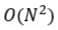
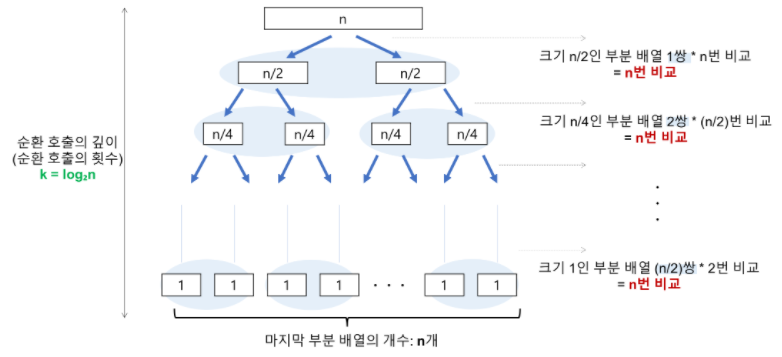

# 📚 정렬(Sorting) 알고리즘

> 정렬(Sorting)이란 "특정한 기준에 따라 데이터를 나열"하는 것을 말한다.

프로그램에서 데이터를 정렬하기 위한 알고리즘에는 굉장히 많은 종류가 있다. 그중 자주 사용되는 다음 몇 가지를 먼저 알아보도록 한다. 

 

# 💡 정렬(Sorting) 알고리즘 종류 및 동작 과정

### [선택 정렬(Selection Sort)](reference/selection_sort.py)

매번 리스트에서 최소값을 찾아 앞의 값과 하나씩 교환하며 정렬하는 방법이다.

> 선택 정렬의 동작 과정은 다음과 같다.

1. 주어진 리스트에서 최소값을 찾는다.
2. 그 값을 리스트의 맨 앞의 값과 위치를 교환한다.
3. 남은 모든 데이터에 대해 정렬이 완료될 때까지 1-2번 과정을 반복한다.

> N개의 데이터에 대한 선택 정렬의 효율성을 알아보자.

선택 정렬은 데이터의 상태에 상관없이 항상 다음 두 연산을 수행한다.

    1. 비교 연산 : N(N-1)/2번(N-1 + N-2 + ... + 1)
    2. 교환 연산 : N번

총 N(N-1)/2 + N번의 연산을 수행하므로 <strong>선택 정렬의 시간 복잡도는 항상 </strong>이다. 

결론 : **어떤 상황에서도** 선택 정렬 알고리즘은 이라는 **동일한 효율성**을 보인다.

 

출처: [위키미디어](https://commons.wikimedia.org/wiki/File:Selection_sort_animation.gif)
/ [jinhyy님 티스토리](https://jinhyy.tistory.com/9)

 

### [삽입 정렬(Insertion Sort)](reference/insertion_sort.py)

현재 값을 리스트의 정렬된 앞 부분과 비교하며 적절한 위치에 삽입하여 정렬하는 방법이다.

> 삽입 정렬의 동작 과정은 다음과 같다.

1. 리스트의 현재 값과 바로 이전 값을 비교하고 이전 값이 더 클 경우 두 값의 위치를 교환한다.
2. 현재 값이 더 이상 앞으로 이동할 수 없을 때까지 순차적으로 1번 과정을 반복한다.
3. 남은 모든 데이터에 대해 정렬이 완료될 때까지 1-2번 과정을 반복한다.

> N개의 데이터에 대한 삽입 정렬의 효율성을 알아보자.

삽입 정렬의 주요 연산은 선택 정렬과 동일한 "비교"와 "교환" 연산이다. 
하지만, 삽입 정렬은 선택 정렬과 달리 데이터의 정렬된 상태에 영향을 받는다.

다음 최선과 최악의 경우에서 효율성을 살펴보면

- 최선 == 데이터가 정렬되어 있는 상태

      N-1개의 데이터가 각 1번의 비교 연산만 수행 : 총 N-1번
      따라서, 시간 복잡도는 O(N)이다.

- 최악 == 데이터가 역정렬되어 있는 상태

      비교 및 교환 연산 : 각 N(N-1)/2번(1 + 2 + ... + N-1)
      총 연산 횟수는 N(N-1)번
      따라서, 시간 복잡도는 O(N^2)이다.

위 분석 내용에 의하면

1. <strong>최선의 경우 시간 복잡도는 O(N)</strong>으로 선택 정렬에 비해 매우 빠르다.
2. <strong>최악의 경우 시간 복잡도는 </strong>으로 선택 정렬과 동일하나, 선택 정렬보다 더 많은 교환 연산이 발생하므로 선택 정렬보다 효율성이 낮다고 할 수 있다. 

결론 : 데이터가 **거의 정렬된 상태**에서 삽입 정렬 알고리즘은 **우수한 효율성**을 보인다.

 

출처: [위키미디어](https://commons.wikimedia.org/wiki/File:Selection_sort_animation.gif) / [jinhyy님 티스토리](https://jinhyy.tistory.com/9)

 

### [퀵 정렬(Quick Sort)](reference/quick_sort.py)

기준이 되는 피벗(pivot)을 정하여 정렬한 후 피벗을 기준으로 계속 분할하며 정렬하는 방법이다. 
퀵 정렬에도 피벗을 정하고 리스트를 분할하는 방법에 따라 여러 가지 방식이 있다고 한다.

> 그 중 **호어 분할** 방식으로 퀵 정렬의 동작 과정을 알아보자!

호어 분할(Hoare Partition) : 리스트의 첫 번째 데이터를 피벗으로 정한다.

1. 리스트의 첫 번째 값을 피벗으로 정한다.
2. 피벗을 제외한 리스트의 좌측에서는 피벗보다 큰 값을, 우측에서는 피벗보다 작은 값을 찾아 서로 위치를 교환한다.
3. 2번 과정을 반복하면서 좌우측 인덱스가 같아지거나 엇갈리면 둘 중 작은 값과 피벗의 위치를 교환하고 피벗의 위치를 기준으로 좌우측을 분할한다.
4. 분할된 리스트의 데이터 개수가 1이 될 때까지 각 분할된 리스트에 대해 1-3번 과정을 반복한다.

> N개의 데이터에 대한 퀵 정렬의 효율성을 알아보자.

퀵 정렬의 주요 연산도 역시 비교와 교환 연산이지만, 퀵 정렬에서 가장 중요한 것은 데이터가 "**분할되는 위치**"이다.

다음 분할되는 위치에 따른 최선과 최악의 경우에서 효율성을 살펴보면

- 최선 == 데이터가 정확히 반씩 분할될 때

       먼저, N개의 데이터가 반씩 감소하여 1개가 남았을 때까지의 분할 횟수 K를 구하면
      N * (1/2)^K = 1와 같은 식에 의해 K = logN이다.(밑이 2인 log를 의미)

       다음 단계는 수식에 대한 증명없이 하단의 그림을 참고해 직관적으로 생각해보자.
      데이터가 분할하지만 결국 분할된 각각에 대해 비교 연산 횟수를 합치면 모두 n번으로 동일할 것이다.(물론, 비교 연산 외 다른 요소들을 제외했을 때...)

       위 내용을 바탕으로 N번의 비교 연산을 총 logN번 반복한다고 할 수 있다.
      따라서, 시간 복잡도는 O(NlogN)이다.

출처: [권희정님 깃허브](https://gmlwjd9405.github.io/2018/05/10/algorithm-quick-sort.html)

- 최악 == 데이터가 한쪽으로 치우쳐서 분할될 때(== 정렬되거나 역정렬된 상태)

      정렬된 상태의 리스트를 기준으로 생각해보자.

       호어 분할에 의해 리스트의 첫 번째 값을 피벗으로 정하면 정렬된 상태의 리스트이므로 피벗의 좌측 값들은 모두 피벗 값보다 크다. 이로인해 항상 좌측 인덱스 값은 고정되어 있고 우측 인덱스 값이 현재 피벗의 위치까지 이동해야 한다.

       분할하며 수행하는 비교 연산의 총 횟수를 구하면 N + N-1 + ... + 1이므로 N(N+1)/2번이다.
      따라서, 시간 복잡도는 O(N^2)이다.

위 분석 내용에 의하면

1. <strong>최선의 경우 시간 복잡도는 O(NlogN)</strong>으로 위 다른 정렬 알고리즘에 비해 효율성이 우수하다.
2. <strong>최악의 경우 시간 복잡도는 </strong>으로 위 다른 정렬 알고리즘과 비슷한 수준의 효율성을 보인다. 

하지만, 일반적인 상황에서 데이터가 한쪽으로 치우쳐져 있는 경우는 드물기 때문에 퀵 정렬 알고리즘이 다른 정렬 알고리즘에 비해 우수한 효율성을 보인다고 할 수 있다. 

결론 : **데이터가 잘 분산되어 있는 상황**에서 퀵 정렬 알고리즘은 다른 정렬 알고리즘에 비해 **우수한 효율성**을 보인다.

 

출처: [위키미디어](https://commons.wikimedia.org/wiki/File:Selection_sort_animation.gif) / [jinhyy님 티스토리](https://jinhyy.tistory.com/9)

 

### [계수 정렬(Counting Sort)](reference/counting_sort.py)

특정한 조건 하에 사용 가능하지만 다른 비교 기반 알고리즘들에 비해 매우 빠른 정렬 속도를 지닌다.

> 계수 정렬은 정렬할 리스트의 데이터를 모두 카운트하여 정렬하는 방법으로 다음 조건이 따른다.

1. 정렬할 리스트의 데이터는 모두 양의 정수이며 그 범위가 제한적이다.
2. 데이터의 최소값과 최대값 둘의 차이가 크지 않다.

> 위 조건을 만족했을 때 계수 정렬의 동작 과정은 다음과 같다.

1. 정렬할 리스트의 최대값을 구하고 "최대값 + 1" 크기로 카운트 리스트를 생성한다.
2. 정렬할 리스트를 순회하며 해당 데이터 값을 카운트 리스트의 인덱스 값으로 하여 해당 값을 1씩 증가시킨다.
   예) [10, 22, 3] -> cnt_list[10] += 1
3. 카운트 리스트를 순회하며 각 인덱스 값을 카운트 수만큼 순차적으로 출력한다.

여기서, 카운트 리스트는 정렬된 상태의 리스트를 의미하고 최대값 + 1의 크기를 갖는 것은 리스트의 인덱스가 0부터 시작하기 떄문에 최대값을 담기 위함이다. 

특히, 계수 정렬은 정렬할 데이터의 모든 범위를 포함하는 리스트를 생성해야 하므로 데이터 간 간격이 작고 중복된 데이터가 많을 수록 더욱 효과적이라 할 수 있다.

> N개의 데이터와 최대값 K를 가질 때 계수 정렬의 효율성을 알아보자.

계수 정렬의 주요 연산은 "카운트 연산"이며, 항상 다음 두 연산을 수행한다.

    1. N개의 데이터를 순회하며 수행하는 카운트 연산 : N번
    2. 카운트 리스트를 순회하며 정렬된 데이터를 확인하는 연산 : K번

총 N + K번의 연산을 수행하므로 <strong>계수 정렬의 시간 복잡도는 항상 O(N+K)</strong>이다. 

결론 : **조건이 만족하는한 최악의 경우에도** 계수 정렬 알고리즘은 다른 비교 기반 정렬 알고리즘에 비해 **매우 우수한 효율성**을 보인다.
